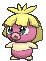
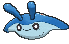

# Route 117 — Trainer Pokémon

---

## [ Main Area ]

### Trainer Rosters

### Rematches

| Trainer | P1 | P2 | P3 | P4 | P5 | P6 |
|:-------:|:--:|:--:|:--:|:--:|:--:|:--:|
| ") Teammates Anna & Meg (4) [623] | 
 [Furret](../../pokemon/furret.md) Lv. 35
 | 
 [Stoutland](../../pokemon/stoutland.md) Lv. 36
 |
| ") Teammates Anna & Meg (5) [624] | 
 [Furret](../../pokemon/furret.md) Lv. 39
 | 
 [Stoutland](../../pokemon/stoutland.md) Lv. 40
 |
| ") Teammates Anna & Meg (7) [625] | 
 [Furret](../../pokemon/furret.md) Lv. 59
 | 
 [Stoutland](../../pokemon/stoutland.md) Lv. 60
 |
| ") Teammates Anna & Meg (C) [626] | 
 [Furret](../../pokemon/furret.md) Lv. 75
 | 
 [Stoutland](../../pokemon/stoutland.md) Lv. 76
 |
| ") Triathlete Runner Dylan (4) [494] | 
 [Growlithe](../../pokemon/growlithe.md) Lv. 35
 | 
 [Grovyle](../../pokemon/grovyle.md) Lv. 35
 | 
 [Dodrio](../../pokemon/dodrio.md) Lv. 35
 |
| ") Triathlete Runner Dylan (6) [495] | 
 [Arcanine](../../pokemon/arcanine.md) Lv. 47
 | 
 [Sceptile](../../pokemon/sceptile.md) Lv. 47
 | 
 [Dodrio](../../pokemon/dodrio.md) Lv. 47
 | 
 [Poliwrath](../../pokemon/poliwrath.md) Lv. 47
 |
| ") Triathlete Runner Dylan (8) [496] | 
 [Arcanine](../../pokemon/arcanine.md) Lv. 64
 | 
 [Sceptile](../../pokemon/sceptile.md) Lv. 64
 | 
 [Dodrio](../../pokemon/dodrio.md) Lv. 64
 | 
 [Poliwrath](../../pokemon/poliwrath.md) Lv. 64
 |
| ") Triathlete Runner Dylan (C) [497] | 
 [Arcanine](../../pokemon/arcanine.md) Lv. 75
 | 
 [Sceptile](../../pokemon/sceptile.md) Lv. 75
 | 
 [Dodrio](../../pokemon/dodrio.md) Lv. 75
 | 
 [Poliwrath](../../pokemon/poliwrath.md) Lv. 75
 |
| ") PKMN Breeder Lydia (4) [519] | 
 [Clefairy](../../pokemon/clefairy.md) Lv. 35
 | 
 [Jigglypuff](../../pokemon/jigglypuff.md) Lv. 35
 | 
 [Togetic](../../pokemon/togetic.md) Lv. 35
 | 
 [Roselia](../../pokemon/roselia.md) Lv. 35
 | 
 [Smoochum](../../pokemon/smoochum.md) Lv. 35
 | 
 [Mantyke](../../pokemon/mantyke.md) Lv. 35
 |
| ") PKMN Breeder Lydia (5) [520] | 
 [Clefairy](../../pokemon/clefairy.md) Lv. 39
 | 
 [Jigglypuff](../../pokemon/jigglypuff.md) Lv. 39
 | 
 [Togetic](../../pokemon/togetic.md) Lv. 39
 | 
 [Roselia](../../pokemon/roselia.md) Lv. 39
 | 
 [Jynx](../../pokemon/jynx.md) Lv. 39
 | 
 [Mantine](../../pokemon/mantine.md) Lv. 39
 |
| ") PKMN Breeder Lydia (7) [521] | 
 [Clefable](../../pokemon/clefable.md) Lv. 59
 | 
 [Wigglytuff](../../pokemon/wigglytuff.md) Lv. 59
 | 
 [Togekiss](../../pokemon/togekiss.md) Lv. 59
 | 
 [Roserade](../../pokemon/roserade.md) Lv. 59
 | 
 [Jynx](../../pokemon/jynx.md) Lv. 59
 | 
 [Mantine](../../pokemon/mantine.md) Lv. 59
 |
| ") PKMN Breeder Lydia (C) [522] | 
 [Clefable](../../pokemon/clefable.md) Lv. 75
 | 
 [Wigglytuff](../../pokemon/wigglytuff.md) Lv. 75
 | 
 [Togekiss](../../pokemon/togekiss.md) Lv. 75
 | 
 [Roserade](../../pokemon/roserade.md) Lv. 75
 | 
 [Jynx](../../pokemon/jynx.md) Lv. 75
 | 
 [Mantine](../../pokemon/mantine.md) Lv. 75
 |
| ") PKMN Breeder Isaac (4) [523] | 
 [Pikachu](../../pokemon/pikachu.md) Lv. 35
 | 
 [Marill](../../pokemon/marill.md) Lv. 35
 | 
 [Electabuzz](../../pokemon/electabuzz.md) Lv. 35
 | 
 [Magmar](../../pokemon/magmar.md) Lv. 35
 | 
 [Riolu](../../pokemon/riolu.md) Lv. 35
 | 
 [Munchlax](../../pokemon/munchlax.md) Lv. 35
 |
| ") PKMN Breeder Isaac (5) [524] | 
 [Pikachu](../../pokemon/pikachu.md) Lv. 39
 | 
 [Marill](../../pokemon/marill.md) Lv. 39
 | 
 [Electabuzz](../../pokemon/electabuzz.md) Lv. 39
 | 
 [Magmar](../../pokemon/magmar.md) Lv. 39
 | 
 [Lucario](../../pokemon/lucario.md) Lv. 39
 | 
 [Snorlax](../../pokemon/snorlax.md) Lv. 39
 |
| ") PKMN Breeder Isaac (7) [525] | 
 [Raichu](../../pokemon/raichu.md) Lv. 59
 | 
 [Azumarill](../../pokemon/azumarill.md) Lv. 59
 | 
 [Electivire](../../pokemon/electivire.md) Lv. 59
 | 
 [Magmortar](../../pokemon/magmortar.md) Lv. 59
 | 
 [Lucario](../../pokemon/lucario.md) Lv. 59
 | 
 [Snorlax](../../pokemon/snorlax.md) Lv. 59
 |
| ") PKMN Breeder Isaac (C) [526] | 
 [Raichu](../../pokemon/raichu.md) Lv. 75
 | 
 [Azumarill](../../pokemon/azumarill.md) Lv. 75
 | 
 [Electivire](../../pokemon/electivire.md) Lv. 75
 | 
 [Magmortar](../../pokemon/magmortar.md) Lv. 75
 | 
 [Lucario](../../pokemon/lucario.md) Lv. 75
 | 
 [Snorlax](../../pokemon/snorlax.md) Lv. 75
 |

