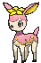

# Route 117 — Wild Pokémon

### Grass

| Sprite | Pokémon | Encounter Type | Chance |
|:------:|---------|:--------------:|--------|
|  | [Farfetch'd*](../../pokemon/farfetchd.md/) Lv. 18 |  Grass | 5% |
|  | [Smeargle](../../pokemon/smeargle.md/) Lv. 18 |  Grass | 10% |
|  | [Volbeat](../../pokemon/volbeat.md/) Lv. 18 |  Grass | 10% |
|  | [Illumise](../../pokemon/illumise.md/) Lv. 18 |  Grass | 10% |
|  | [Roselia](../../pokemon/roselia.md/) Lv. 18 |  Grass | 10% |
|  | [Cherubi](../../pokemon/cherubi.md/) Lv. 18 |  Grass | 10% |
|  | [Bonsly](../../pokemon/bonsly.md/) Lv. 18 |  Grass | 10% |
|  | [Mime Jr.](../../pokemon/mime-jr.md/) Lv. 18 |  Grass | 10% |
|  | [Chansey*](../../pokemon/chansey.md/) Lv. 18 |  Grass | 5% |
|  | [Ducklett](../../pokemon/ducklett.md/) Lv. 18 |  Grass | 10% |
|  | [Deerling](../../pokemon/deerling.md/) Lv. 18 |  Grass | 10% |

### DexNav

| Sprite | Pokémon | Encounter Type | Chance |
|:------:|---------|:--------------:|--------|
|  | [Sawsbuck](../../pokemon/sawsbuck.md/) Lv. 50 |  DexNav | 100% |

### Horde

| Sprite | Pokémon | Encounter Type | Chance |
|:------:|---------|:--------------:|--------|
|  | [Happiny](../../pokemon/happiny.md/) Lv. 12 |  Horde | 100% |

### Surfing

| Sprite | Pokémon | Encounter Type | Chance |
|:------:|---------|:--------------:|--------|
|  | [Ducklett](../../pokemon/ducklett.md/) Lv. 25 - 35 |  Surfing | 50% |
|  | [Swanna](../../pokemon/swanna.md/) Lv. 25 - 35 |  Surfing | 50% |

### Old Rod

| Sprite | Pokémon | Encounter Type | Chance |
|:------:|---------|:--------------:|--------|
|  | [Poliwag](../../pokemon/poliwag.md/) Lv. 20 |  Old Rod | 100% |

### Good Rod

| Sprite | Pokémon | Encounter Type | Chance |
|:------:|---------|:--------------:|--------|
|  | [Poliwag](../../pokemon/poliwag.md/) Lv. 35 |  Good Rod | 100% |

### Super Rod

| Sprite | Pokémon | Encounter Type | Chance |
|:------:|---------|:--------------:|--------|
|  | [Poliwhirl](../../pokemon/poliwhirl.md/) Lv. 55 |  Super Rod | 100% |

