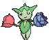

# Route 118 — Trainer Pokémon

### Generic Trainers

### Rematches

| Trainer | P1 | P2 | P3 | P4 |
|:-------:|:--:|:--:|:--:|:--:|
| ") Aroma Lady Rose (4) [421] | 
 [Sunflora](../../pokemon/sunflora.md) Lv. 35
 | 
 [Bayleef](../../pokemon/bayleef.md) Lv. 35
 | 
 [Roselia](../../pokemon/roselia.md) Lv. 35
 | 
 [Gloom](../../pokemon/gloom.md) Lv. 35
 |
| ") Aroma Lady Rose (6) [422] | 
 [Sunflora](../../pokemon/sunflora.md) Lv. 47
 | 
 [Meganium](../../pokemon/meganium.md) Lv. 47
 | 
 [Roserade](../../pokemon/roserade.md) Lv. 47
 | 
 [Bellossom](../../pokemon/bellossom.md) Lv. 47
 |
| ") Aroma Lady Rose (8) [423] | 
 [Sunflora](../../pokemon/sunflora.md) Lv. 64
 | 
 [Meganium](../../pokemon/meganium.md) Lv. 64
 | 
 [Roserade](../../pokemon/roserade.md) Lv. 64
 | 
 [Bellossom](../../pokemon/bellossom.md) Lv. 64
 |
| ") Aroma Lady Rose (C) [424] | 
 [Sunflora](../../pokemon/sunflora.md) Lv. 75
 | 
 [Meganium](../../pokemon/meganium.md) Lv. 75
 | 
 [Roserade](../../pokemon/roserade.md) Lv. 75
 | 
 [Bellossom](../../pokemon/bellossom.md) Lv. 75
 |
| ") Guitarist Dalton (4) [425] | 
 [Magneton](../../pokemon/magneton.md) Lv. 35
 | 
 [Loudred](../../pokemon/loudred.md) Lv. 35
 | 
 [Chatot](../../pokemon/chatot.md) Lv. 35
 | 
 [Scolipede](../../pokemon/scolipede.md) Lv. 35
 |
| ") Guitarist Dalton (6) [426] | 
 [Magneton](../../pokemon/magneton.md) Lv. 47
 | 
 [Exploud](../../pokemon/exploud.md) Lv. 47
 | 
 [Chatot](../../pokemon/chatot.md) Lv. 47
 | 
 [Scolipede](../../pokemon/scolipede.md) Lv. 47
 |
| ") Guitarist Dalton (8) [427] | 
 [Magnezone](../../pokemon/magnezone.md) Lv. 64
 | 
 [Exploud](../../pokemon/exploud.md) Lv. 64
 | 
 [Chatot](../../pokemon/chatot.md) Lv. 64
 | 
 [Scolipede](../../pokemon/scolipede.md) Lv. 64
 |
| ") Guitarist Dalton (C) [428] | 
 [Magnezone](../../pokemon/magnezone.md) Lv. 75
 | 
 [Exploud](../../pokemon/exploud.md) Lv. 75
 | 
 [Chatot](../../pokemon/chatot.md) Lv. 75
 | 
 [Scolipede](../../pokemon/scolipede.md) Lv. 75
 |
|  Interviewers Gabby & Ty [173] | 
 [Magnemite](../../pokemon/magnemite.md) Lv. 25
 | 
 [Whismur](../../pokemon/whismur.md) Lv. 25
 | 
 [Porygon](../../pokemon/porygon.md) Lv. 25
 | 
 [Rotom](../../pokemon/rotom.md) Lv. 25
 |
|  Fisherman Barny [316] | 
 [Feebas](../../pokemon/feebas.md) Lv. 38
 | 
 [Feebas](../../pokemon/feebas.md) Lv. 38
 |
|  Bird Keeper Chester [318] | 
 [Staravia](../../pokemon/staravia.md) Lv. 37
 | 
 [Fearow](../../pokemon/fearow.md) Lv. 37
 | 
 [Vullaby](../../pokemon/vullaby.md) Lv. 37
 |
|  Bird Keeper Perry [102] | 
 [Tranquill](../../pokemon/tranquill.md) Lv. 37
 | 
 [Noctowl](../../pokemon/noctowl.md) Lv. 37
 | 
 [Rufflet](../../pokemon/rufflet.md) Lv. 37
 |
|  Delinquent Miley [799] | 
 [Mightyena](../../pokemon/mightyena.md) Lv. 38
 | 
 [Liepard](../../pokemon/liepard.md) Lv. 38
 | 
 [Zoroark](../../pokemon/zoroark.md) Lv. 38
 |

