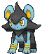

# Route 118 — Wild Pokémon

### Grass

| Sprite | Pokémon | Encounter Type | Level | Chance |
|:------:|---------|:--------------:|-------|--------|
|  | [Golduck](../../pokemon/golduck.md/) |  Grass | 33 | 10% |
|  | [Slowbro](../../pokemon/slowbro.md/) |  Grass | 33 | 10% |
|  | [Linoone](../../pokemon/linoone.md/) |  Grass | 33 | 10% |
|  | [Manectric](../../pokemon/manectric.md/) |  Grass | 33 | 10% |
|  | [Luxio](../../pokemon/luxio.md/) |  Grass | 33 | 10% |
|  | [Pachirisu](../../pokemon/pachirisu.md/) |  Grass | 33 | 10% |
|  | [Chatot](../../pokemon/chatot.md/) |  Grass | 33 | 10% |
|  | [Emolga](../../pokemon/emolga.md/) |  Grass | 33 | 10% |
|  | [Inkay](../../pokemon/inkay.md/) |  Grass | 33 | 10% |
|  | [Dedenne](../../pokemon/dedenne.md/) |  Grass | 33 | 10% |

### Tall Grass

| Sprite | Pokémon | Encounter Type | Level | Chance |
|:------:|---------|:--------------:|-------|--------|
|  | [Golduck](../../pokemon/golduck.md/) |  Tall Grass | 36 | 10% |
|  | [Slowbro](../../pokemon/slowbro.md/) |  Tall Grass | 36 | 10% |
|  | [Linoone](../../pokemon/linoone.md/) |  Tall Grass | 36 | 10% |
|  | [Manectric](../../pokemon/manectric.md/) |  Tall Grass | 36 | 10% |
|  | [Luxio](../../pokemon/luxio.md/) |  Tall Grass | 36 | 10% |
|  | [Pachirisu](../../pokemon/pachirisu.md/) |  Tall Grass | 36 | 10% |
|  | [Chatot](../../pokemon/chatot.md/) |  Tall Grass | 36 | 10% |
|  | [Emolga](../../pokemon/emolga.md/) |  Tall Grass | 36 | 10% |
|  | [Malamar](../../pokemon/malamar.md/) |  Tall Grass | 36 | 10% |
|  | [Dedenne](../../pokemon/dedenne.md/) |  Tall Grass | 36 | 10% |

### DexNav

| Sprite | Pokémon | Encounter Type | Level | Chance |
|:------:|---------|:--------------:|-------|--------|
|  | [Slowking](../../pokemon/slowking.md/) |  DexNav | 50 | 100% |

### Horde

| Sprite | Pokémon | Encounter Type | Level | Chance |
|:------:|---------|:--------------:|-------|--------|
|  | [Marshtomp](../../pokemon/marshtomp.md/) |  Horde | 30 | 100% |

### Surfing

| Sprite | Pokémon | Encounter Type | Level | Chance |
|:------:|---------|:--------------:|-------|--------|
|  | [Wingull](../../pokemon/wingull.md/) |  Surfing | 25 - 35 | 50% |
|  | [Pelipper](../../pokemon/pelipper.md/) |  Surfing | 25 - 35 | 50% |

### Old Rod

| Sprite | Pokémon | Encounter Type | Level | Chance |
|:------:|---------|:--------------:|-------|--------|
|  | [Carvanha](../../pokemon/carvanha.md/) |  Old Rod | 20 | 50% |
|  | [Feebas*](../../pokemon/feebas.md/) |  Old Rod | 20 | 50% |

### Good Rod

| Sprite | Pokémon | Encounter Type | Level | Chance |
|:------:|---------|:--------------:|-------|--------|
|  | [Carvanha](../../pokemon/carvanha.md/) |  Good Rod | 35 | 50% |
|  | [Feebas*](../../pokemon/feebas.md/) |  Good Rod | 35 | 50% |

### Super Rod

| Sprite | Pokémon | Encounter Type | Level | Chance |
|:------:|---------|:--------------:|-------|--------|
|  | [Sharpedo](../../pokemon/sharpedo.md/) |  Super Rod | 55 | 100% |

