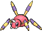
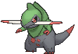
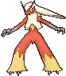

# Route 119 — Trainer Pokémon

---

## [ Mauville ]

### Trainer Rosters

| Trainer | P1 | P2 | P3 |
|:-------:|:--:|:--:|:--:|
|  Bug Maniac Donald [104] | 
 [Scyther](../../pokemon/scyther.md) Lv. 40
 | 
 [Pinsir](../../pokemon/pinsir.md) Lv. 40
 | 
 [Heracross](../../pokemon/heracross.md) Lv. 40
 |
|  Bug Catcher Doug [106] | 
 [Beautifly](../../pokemon/beautifly.md) Lv. 39
 | 
 [Parasect](../../pokemon/parasect.md) Lv. 39
 | 
 [Ninjask](../../pokemon/ninjask.md) Lv. 39
 |
|  Bug Catcher Kent [108] | 
 [Dustox](../../pokemon/dustox.md) Lv. 39
 | 
 [Venomoth](../../pokemon/venomoth.md) Lv. 39
 | 
 [Wormadam](../../pokemon/wormadam-plant.md) Lv. 39
 |
|  Bug Catcher Greg [107] | 
 [Ariados](../../pokemon/ariados.md) Lv. 39
 | 
 [Vivillon](../../pokemon/vivillon.md) Lv. 39
 | 
 [Beedrill](../../pokemon/beedrill.md) Lv. 39
 |
|  Bug Maniac Taylor [105] | 
 [Yanmega](../../pokemon/yanmega.md) Lv. 40
 | 
 [Vespiquen](../../pokemon/vespiquen.md) Lv. 40
 | 
 [Armaldo](../../pokemon/armaldo.md) Lv. 40
 |
|  Bug Maniac Brent [103] | 
 [Scizor](../../pokemon/scizor.md) Lv. 40
 | 
 [Durant](../../pokemon/durant.md) Lv. 40
 | 
 [Escavalier](../../pokemon/escavalier.md) Lv. 40
 |
|  PKMN Ranger Catherine [110] | 
 [Fraxure](../../pokemon/fraxure.md) Lv. 40
 | 
 [Torterra](../../pokemon/torterra.md) Lv. 40
 | 
 [Excadrill](../../pokemon/excadrill.md) Lv. 40
 |
|  Brains & Brawn Jael & Kael [731] | 
 [Alakazam](../../pokemon/alakazam.md) Lv. 43
 | 
 [Conkeldurr](../../pokemon/conkeldurr.md) Lv. 43
 |
|  PKMN Ranger Jackson [109] | 
 [Vigoroth](../../pokemon/vigoroth.md) Lv. 40
 | 
 [Heatmor](../../pokemon/heatmor.md) Lv. 40
 | 
 [Tropius](../../pokemon/tropius.md) Lv. 40
 |
|  Bird Keeper Hugh [111] | 
 [Dodrio](../../pokemon/dodrio.md) Lv. 41
 | 
 [Swellow](../../pokemon/swellow.md) Lv. 41
 |
|  Ninja Boy Takashi [114] | 
 [Accelgor](../../pokemon/accelgor.md) Lv. 42
 |
|  Bird Keeper Phil [112] | 
 [Natu](../../pokemon/natu.md) Lv. 40
 | 
 [Natu](../../pokemon/natu.md) Lv. 40
 | 
 [Xatu](../../pokemon/xatu.md) Lv. 40
 |

### Rematches

| Trainer | P1 | P2 | P3 | P4 |
|:-------:|:--:|:--:|:--:|:--:|
| ") PKMN Ranger Catherine (6) [433] | 
 [Fraxure](../../pokemon/fraxure.md) Lv. 47
 | 
 [Torterra](../../pokemon/torterra.md) Lv. 47
 | 
 [Excadrill](../../pokemon/excadrill.md) Lv. 47
 | 
 [Beartic](../../pokemon/beartic.md) Lv. 47
 |
| ") PKMN Ranger Catherine (7) [434] | 
 [Haxorus](../../pokemon/haxorus.md) Lv. 59
 | 
 [Torterra](../../pokemon/torterra.md) Lv. 59
 | 
 [Excadrill](../../pokemon/excadrill.md) Lv. 59
 | 
 [Beartic](../../pokemon/beartic.md) Lv. 59
 |
| ") PKMN Ranger Catherine (8) [435] | 
 [Haxorus](../../pokemon/haxorus.md) Lv. 64
 | 
 [Torterra](../../pokemon/torterra.md) Lv. 64
 | 
 [Excadrill](../../pokemon/excadrill.md) Lv. 64
 | 
 [Beartic](../../pokemon/beartic.md) Lv. 64
 |
| ") PKMN Ranger Catherine (C) [436] | 
 [Haxorus](../../pokemon/haxorus.md) Lv. 75
 | 
 [Torterra](../../pokemon/torterra.md) Lv. 75
 | 
 [Excadrill](../../pokemon/excadrill.md) Lv. 75
 | 
 [Beartic](../../pokemon/beartic.md) Lv. 75
 |
| ") Brains & Brawn Jael & Kael (6) [733] | 
 [Alakazam](../../pokemon/alakazam.md) Lv. 47
 | 
 [Conkeldurr](../../pokemon/conkeldurr.md) Lv. 47
 |
| ") Brains & Brawn Jael & Kael (7) [734] | 
 [Alakazam](../../pokemon/alakazam.md) Lv. 59
 | 
 [Conkeldurr](../../pokemon/conkeldurr.md) Lv. 59
 | 
 [Reuniclus](../../pokemon/reuniclus.md) Lv. 59
 | 
 [Machamp](../../pokemon/machamp.md) Lv. 59
 |
| ") Brains & Brawn Jael & Kael (8) [735] | 
 [Alakazam](../../pokemon/alakazam.md) Lv. 64
 | 
 [Conkeldurr](../../pokemon/conkeldurr.md) Lv. 64
 | 
 [Reuniclus](../../pokemon/reuniclus.md) Lv. 64
 | 
 [Machamp](../../pokemon/machamp.md) Lv. 64
 |
| ") Brains & Brawn Jael & Kael (C) [736] | 
 [Alakazam](../../pokemon/alakazam.md) Lv. 75
 | 
 [Conkeldurr](../../pokemon/conkeldurr.md) Lv. 75
 | 
 [Reuniclus](../../pokemon/reuniclus.md) Lv. 75
 | 
 [Machamp](../../pokemon/machamp.md) Lv. 75
 |
| ") PKMN Ranger Jackson (6) [429] | 
 [Vigoroth](../../pokemon/vigoroth.md) Lv. 47
 | 
 [Heatmor](../../pokemon/heatmor.md) Lv. 47
 | 
 [Tropius](../../pokemon/tropius.md) Lv. 47
 | 
 [Kingdra](../../pokemon/kingdra.md) Lv. 47
 |
| ") PKMN Ranger Jackson (7) [430] | 
 [Slaking](../../pokemon/slaking.md) Lv. 59
 | 
 [Heatmor](../../pokemon/heatmor.md) Lv. 59
 | 
 [Tropius](../../pokemon/tropius.md) Lv. 59
 | 
 [Kingdra](../../pokemon/kingdra.md) Lv. 59
 |
| ") PKMN Ranger Jackson (8) [431] | 
 [Slaking](../../pokemon/slaking.md) Lv. 64
 | 
 [Heatmor](../../pokemon/heatmor.md) Lv. 64
 | 
 [Tropius](../../pokemon/tropius.md) Lv. 64
 | 
 [Kingdra](../../pokemon/kingdra.md) Lv. 64
 |
| ") PKMN Ranger Jackson (C) [432] | 
 [Slaking](../../pokemon/slaking.md) Lv. 75
 | 
 [Heatmor](../../pokemon/heatmor.md) Lv. 75
 | 
 [Tropius](../../pokemon/tropius.md) Lv. 75
 | 
 [Kingdra](../../pokemon/kingdra.md) Lv. 75
 |

---

## [ Fortree ]

### Trainer Rosters

| Trainer | P1 | P2 | P3 | P4 | P5 |
|:-------:|:--:|:--:|:--:|:--:|:--:|
|  PKMN Trainer Brendan [292] | 
 [Swellow](../../pokemon/swellow.md) Lv. 47
 | 
 [Raichu](../../pokemon/raichu.md) Lv. 47
 | 
 [Rapidash](../../pokemon/rapidash.md) Lv. 47
 | 
 [Wailord](../../pokemon/wailord.md) Lv. 47
 | 
 [Sceptile](../../pokemon/sceptile.md) Lv. 49
 |
|  PKMN Trainer Brendan [293] | 
 [Swellow](../../pokemon/swellow.md) Lv. 47
 | 
 [Raichu](../../pokemon/raichu.md) Lv. 47
 | 
 [Wailord](../../pokemon/wailord.md) Lv. 47
 | 
 [Breloom](../../pokemon/breloom.md) Lv. 47
 | 
 [Blaziken](../../pokemon/blaziken.md) Lv. 49
 |
|  PKMN Trainer Brendan [294] | 
 [Swellow](../../pokemon/swellow.md) Lv. 47
 | 
 [Raichu](../../pokemon/raichu.md) Lv. 47
 | 
 [Breloom](../../pokemon/breloom.md) Lv. 47
 | 
 [Rapidash](../../pokemon/rapidash.md) Lv. 47
 | 
 [Swampert](../../pokemon/swampert.md) Lv. 49
 |
|  PKMN Trainer May [298] | 
 [Swellow](../../pokemon/swellow.md) Lv. 47
 | 
 [Raichu](../../pokemon/raichu.md) Lv. 47
 | 
 [Rapidash](../../pokemon/rapidash.md) Lv. 47
 | 
 [Wailord](../../pokemon/wailord.md) Lv. 47
 | 
 [Sceptile](../../pokemon/sceptile.md) Lv. 49
 |
|  PKMN Trainer May [299] | 
 [Swellow](../../pokemon/swellow.md) Lv. 47
 | 
 [Raichu](../../pokemon/raichu.md) Lv. 47
 | 
 [Wailord](../../pokemon/wailord.md) Lv. 47
 | 
 [Breloom](../../pokemon/breloom.md) Lv. 47
 | 
 [Blaziken](../../pokemon/blaziken.md) Lv. 49
 |
|  PKMN Trainer May [300] | 
 [Swellow](../../pokemon/swellow.md) Lv. 47
 | 
 [Raichu](../../pokemon/raichu.md) Lv. 47
 | 
 [Breloom](../../pokemon/breloom.md) Lv. 47
 | 
 [Rapidash](../../pokemon/rapidash.md) Lv. 47
 | 
 [Swampert](../../pokemon/swampert.md) Lv. 49
 |
|  Ninja Boy Yasu [113] | 
 [Electrode](../../pokemon/electrode.md) Lv. 43
 | 
 [Weezing](../../pokemon/weezing.md) Lv. 43
 |
|  Ninja Boy Hideo [616] | 
 [Greninja](../../pokemon/greninja.md) Lv. 44
 |
|  Fisherman Eugene [551] | 
 [Stunfisk](../../pokemon/stunfisk.md) Lv. 44
 |

### Special Battles

1. [Rival](special_battles.md#rival)

