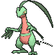

# Route 119 — Wild Pokémon

## [ Mauville ]

### Tall Grass

| Sprite | Pokémon | Encounter | Chance |
|:------:|---------|:---------:|--------|
|  | [Arbok](../../pokemon/arbok.md/) Lv. 36 |  Tall Grass | 10% |
|  | [Gloom](../../pokemon/gloom.md/) Lv. 36 |  Tall Grass | 10% |
|  | [Weepinbell](../../pokemon/weepinbell.md/) Lv. 36 |  Tall Grass | 10% |
|  | [Quagsire](../../pokemon/quagsire.md/) Lv. 36 |  Tall Grass | 10% |
|  | [Tropius](../../pokemon/tropius.md/) Lv. 36 |  Tall Grass | 10% |
|  | [Drapion](../../pokemon/drapion.md/) Lv. 36 |  Tall Grass | 10% |
|  | [Carnivine](../../pokemon/carnivine.md/) Lv. 36 |  Tall Grass | 10% |
|  | [Foongus](../../pokemon/foongus.md/) Lv. 36 |  Tall Grass | 10% |
|  | [Amoonguss](../../pokemon/amoonguss.md/) Lv. 36 |  Tall Grass | 10% |
|  | [Sliggoo](../../pokemon/sliggoo.md/) Lv. 36 |  Tall Grass | 10% |

### Horde

| Sprite | Pokémon | Encounter | Chance |
|:------:|---------|:---------:|--------|
|  | [Grovyle](../../pokemon/grovyle.md/) Lv. 30 |  Horde | 100% |

### Surfing

| Sprite | Pokémon | Encounter | Chance |
|:------:|---------|:---------:|--------|
|  | [Goomy](../../pokemon/goomy.md/) Lv. 30 - 40 |  Surfing | 50% |
|  | [Stunfisk](../../pokemon/stunfisk.md/) Lv. 30 - 40 |  Surfing | 50% |

### Old Rod

| Sprite | Pokémon | Encounter | Chance |
|:------:|---------|:---------:|--------|
|  | [Feebas](../../pokemon/feebas.md/) Lv. 15 |  Old Rod | 100% |

### Good Rod

| Sprite | Pokémon | Encounter | Chance |
|:------:|---------|:---------:|--------|
|  | [Feebas](../../pokemon/feebas.md/) Lv. 35 |  Good Rod | 100% |

### Super Rod

| Sprite | Pokémon | Encounter | Chance |
|:------:|---------|:---------:|--------|
|  | [Feebas](../../pokemon/feebas.md/) Lv. 55 |  Super Rod | 50% |
|  | [Milotic*](../../pokemon/milotic.md/) Lv. 55 |  Super Rod | 50% |

## [ Fortree ]

### Tall Grass

| Sprite | Pokémon | Encounter | Chance |
|:------:|---------|:---------:|--------|
|  | [Arbok](../../pokemon/arbok.md/) Lv. 38 |  Tall Grass | 10% |
|  | [Gloom](../../pokemon/gloom.md/) Lv. 38 |  Tall Grass | 10% |
|  | [Weepinbell](../../pokemon/weepinbell.md/) Lv. 38 |  Tall Grass | 10% |
|  | [Quagsire](../../pokemon/quagsire.md/) Lv. 38 |  Tall Grass | 10% |
|  | [Tropius](../../pokemon/tropius.md/) Lv. 38 |  Tall Grass | 10% |
|  | [Drapion](../../pokemon/drapion.md/) Lv. 38 |  Tall Grass | 10% |
|  | [Carnivine](../../pokemon/carnivine.md/) Lv. 38 |  Tall Grass | 10% |
|  | [Foongus](../../pokemon/foongus.md/) Lv. 38 |  Tall Grass | 10% |
|  | [Amoonguss](../../pokemon/amoonguss.md/) Lv. 38 |  Tall Grass | 10% |
|  | [Sliggoo](../../pokemon/sliggoo.md/) Lv. 38 |  Tall Grass | 10% |

### Horde

| Sprite | Pokémon | Encounter | Chance |
|:------:|---------|:---------:|--------|
|  | [Grovyle](../../pokemon/grovyle.md/) Lv. 30 |  Horde | 100% |

### Surfing

| Sprite | Pokémon | Encounter | Chance |
|:------:|---------|:---------:|--------|
|  | [Goomy](../../pokemon/goomy.md/) Lv. 30 - 40 |  Surfing | 50% |
|  | [Stunfisk](../../pokemon/stunfisk.md/) Lv. 30 - 40 |  Surfing | 50% |

### Old Rod

| Sprite | Pokémon | Encounter | Chance |
|:------:|---------|:---------:|--------|
|  | [Feebas](../../pokemon/feebas.md/) Lv. 15 |  Old Rod | 100% |

### Good Rod

| Sprite | Pokémon | Encounter | Chance |
|:------:|---------|:---------:|--------|
|  | [Feebas](../../pokemon/feebas.md/) Lv. 35 |  Good Rod | 100% |

### Super Rod

| Sprite | Pokémon | Encounter | Chance |
|:------:|---------|:---------:|--------|
|  | [Feebas](../../pokemon/feebas.md/) Lv. 55 |  Super Rod | 50% |
|  | [Milotic*](../../pokemon/milotic.md/) Lv. 55 |  Super Rod | 50% |

