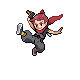
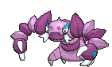
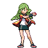
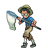
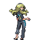

# Route 120 — Trainer Pokémon

---

## [ Fortree ]

### Trainer Rosters

| Trainer | P1 | P2 | P3 | P4 |
|:-------:|:--:|:--:|:--:|:--:|
|  Interviewers Gabby & Ty [173] | 
 [Magnemite](../../pokemon/magnemite.md) Lv. 25
 | 
 [Whismur](../../pokemon/whismur.md) Lv. 25
 | 
 [Porygon](../../pokemon/porygon.md) Lv. 25
 | 
 [Rotom](../../pokemon/rotom.md) Lv. 25
 |
|  Parasol Lady Clarissa [324] | 
 [Castform](../../pokemon/castform.md) Lv. 46
 |
|  Bird Keeper Robert [120] | 
 [Pidgeot](../../pokemon/pidgeot.md) Lv. 46
 |
|  Bird Keeper Colin [119] | 
 [Staraptor](../../pokemon/staraptor.md) Lv. 46
 |

### Rematches

| Trainer | P1 | P2 | P3 | P4 |
|:-------:|:--:|:--:|:--:|:--:|
| ") Bird Keeper Robert (7) [437] | 
 [Altaria](../../pokemon/altaria.md) Lv. 59
 | 
 [Pidgeot](../../pokemon/pidgeot.md) Lv. 59
 | 
 [Staraptor](../../pokemon/staraptor.md) Lv. 59
 |
| ") Bird Keeper Robert (8) [438] | 
 [Altaria](../../pokemon/altaria.md) Lv. 64
 | 
 [Pidgeot](../../pokemon/pidgeot.md) Lv. 64
 | 
 [Staraptor](../../pokemon/staraptor.md) Lv. 64
 | 
 [Fearow](../../pokemon/fearow.md) Lv. 64
 |
| ") Bird Keeper Robert (C) [439] | 
 [Altaria](../../pokemon/altaria.md) Lv. 75
 | 
 [Pidgeot](../../pokemon/pidgeot.md) Lv. 75
 | 
 [Staraptor](../../pokemon/staraptor.md) Lv. 75
 | 
 [Fearow](../../pokemon/fearow.md) Lv. 75
 |

---

## [ Southwest ]

### Trainer Rosters

| Trainer | P1 | P2 | P3 | P4 |
|:-------:|:--:|:--:|:--:|:--:|
|  Ninja Boy Tsunao [618] | 
 [Mothim](../../pokemon/mothim.md) Lv. 46
 | 
 [Toxicroak](../../pokemon/toxicroak.md) Lv. 46
 | 
 [Drapion](../../pokemon/drapion.md) Lv. 46
 |
|  Ace Trainer Jennifer [323] | 
 [Meganium](../../pokemon/meganium.md) Lv. 47
 | 
 [Milotic](../../pokemon/milotic.md) Lv. 47
 | 
 [Mismagius](../../pokemon/mismagius.md) Lv. 47
 | 
 [Raichu](../../pokemon/raichu.md) Lv. 47
 |
|  Parasol Lady Angelica [325] | 
 [Ninetales](../../pokemon/ninetales.md) Lv. 45
 | 
 [Castform](../../pokemon/castform.md) Lv. 45
 | 
 [Sunflora](../../pokemon/sunflora.md) Lv. 45
 | 
 [Cherrim](../../pokemon/cherrim.md) Lv. 45
 |
|  Bug Maniac Brandon [125] | 
 [Kricketune](../../pokemon/kricketune.md) Lv. 47
 | 
 [Ariados](../../pokemon/ariados.md) Lv. 47
 | 
 [Forretress](../../pokemon/forretress.md) Lv. 47
 |
|  Street Thug Gomez [791] | 
 [Houndoom](../../pokemon/houndoom.md) Lv. 47
 | 
 [Amoonguss](../../pokemon/amoonguss.md) Lv. 47
 | 
 [Nidoking](../../pokemon/nidoking.md) Lv. 47
 |
|  Delinquent Sharlene [800] | 
 [Scrafty](../../pokemon/scrafty.md) Lv. 47
 | 
 [Nidoqueen](../../pokemon/nidoqueen.md) Lv. 47
 | 
 [Weavile](../../pokemon/weavile.md) Lv. 47
 |
|  Ruin Maniac Chip [592] | 
 [Cradily](../../pokemon/cradily.md) Lv. 45
 | 
 [Aurorus](../../pokemon/aurorus.md) Lv. 45
 | 
 [Bastiodon](../../pokemon/bastiodon.md) Lv. 45
 | 
 [Tyrantrum](../../pokemon/tyrantrum.md) Lv. 45
 |
|  Ninja Boy Keigo [617] | 
 [Ninjask](../../pokemon/ninjask.md) Lv. 47
 | 
 [Skuntank](../../pokemon/skuntank.md) Lv. 47
 |
|  PKMN Ranger Carlos [123] | 
 [Magnezone](../../pokemon/magnezone.md) Lv. 46
 | 
 [Venusaur](../../pokemon/venusaur.md) Lv. 46
 | 
 [Pyroar](../../pokemon/pyroar.md) Lv. 46
 | 
 [Golduck](../../pokemon/golduck.md) Lv. 46
 |
|  PKMN Ranger Jenna [124] | 
 [Rapidash](../../pokemon/rapidash.md) Lv. 46
 | 
 [Empoleon](../../pokemon/empoleon.md) Lv. 46
 | 
 [Tangrowth](../../pokemon/tangrowth.md) Lv. 46
 | 
 [Luxray](../../pokemon/luxray.md) Lv. 46
 |

### Rematches

| Trainer | P1 | P2 | P3 | P4 |
|:-------:|:--:|:--:|:--:|:--:|
| ") Bug Maniac Brandon (7) [441] | 
 [Kricketune](../../pokemon/kricketune.md) Lv. 59
 | 
 [Ariados](../../pokemon/ariados.md) Lv. 59
 | 
 [Forretress](../../pokemon/forretress.md) Lv. 59
 | 
 [Heracross](../../pokemon/heracross.md) Lv. 59
 |
| ") Bug Maniac Brandon (8) [442] | 
 [Kricketune](../../pokemon/kricketune.md) Lv. 64
 | 
 [Ariados](../../pokemon/ariados.md) Lv. 64
 | 
 [Forretress](../../pokemon/forretress.md) Lv. 64
 | 
 [Heracross](../../pokemon/heracross.md) Lv. 64
 |
| ") Bug Maniac Brandon (C) [443] | 
 [Kricketune](../../pokemon/kricketune.md) Lv. 75
 | 
 [Ariados](../../pokemon/ariados.md) Lv. 75
 | 
 [Forretress](../../pokemon/forretress.md) Lv. 75
 | 
 [Heracross](../../pokemon/heracross.md) Lv. 75
 |
| ") Street Thug Gomez (7) [794] | 
 [Houndoom](../../pokemon/houndoom.md) Lv. 59
 | 
 [Amoonguss](../../pokemon/amoonguss.md) Lv. 59
 | 
 [Nidoking](../../pokemon/nidoking.md) Lv. 59
 | 
 [Absol](../../pokemon/absol.md) Lv. 59
 |
| ") Street Thug Gomez (8) [795] | 
 [Houndoom](../../pokemon/houndoom.md) Lv. 64
 | 
 [Amoonguss](../../pokemon/amoonguss.md) Lv. 64
 | 
 [Nidoking](../../pokemon/nidoking.md) Lv. 64
 | 
 [Absol](../../pokemon/absol.md) Lv. 64
 |
| ") Street Thug Gomez (C) [796] | 
 [Houndoom](../../pokemon/houndoom.md) Lv. 75
 | 
 [Amoonguss](../../pokemon/amoonguss.md) Lv. 75
 | 
 [Nidoking](../../pokemon/nidoking.md) Lv. 75
 | 
 [Absol](../../pokemon/absol.md) Lv. 75
 |
| ") Delinquent Sharlene (7) [802] | 
 [Scrafty](../../pokemon/scrafty.md) Lv. 59
 | 
 [Nidoqueen](../../pokemon/nidoqueen.md) Lv. 59
 | 
 [Weavile](../../pokemon/weavile.md) Lv. 59
 | 
 [Umbreon](../../pokemon/umbreon.md) Lv. 59
 |
| ") Delinquent Sharlene (8) [803] | 
 [Scrafty](../../pokemon/scrafty.md) Lv. 64
 | 
 [Nidoqueen](../../pokemon/nidoqueen.md) Lv. 64
 | 
 [Weavile](../../pokemon/weavile.md) Lv. 64
 | 
 [Umbreon](../../pokemon/umbreon.md) Lv. 64
 |
| ") Delinquent Sharlene (C) [804] | 
 [Scrafty](../../pokemon/scrafty.md) Lv. 75
 | 
 [Nidoqueen](../../pokemon/nidoqueen.md) Lv. 75
 | 
 [Weavile](../../pokemon/weavile.md) Lv. 75
 | 
 [Umbreon](../../pokemon/umbreon.md) Lv. 75
 |

