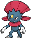
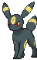

# Route 120 — Trainer Pokémon

---

## [ Fortree ]

### Trainer Rosters

### Rematches

| Trainer | P1 | P2 | P3 | P4 |
|:-------:|:--:|:--:|:--:|:--:|
| ") Bird Keeper Robert (7) [437] | 
 [Altaria](../../pokemon/altaria.md) Lv. 59
 | 
 [Pidgeot](../../pokemon/pidgeot.md) Lv. 59
 | 
 [Staraptor](../../pokemon/staraptor.md) Lv. 59
 |
| ") Bird Keeper Robert (8) [438] | 
 [Altaria](../../pokemon/altaria.md) Lv. 64
 | 
 [Pidgeot](../../pokemon/pidgeot.md) Lv. 64
 | 
 [Staraptor](../../pokemon/staraptor.md) Lv. 64
 | 
 [Fearow](../../pokemon/fearow.md) Lv. 64
 |
| ") Bird Keeper Robert (C) [439] | 
 [Altaria](../../pokemon/altaria.md) Lv. 75
 | 
 [Pidgeot](../../pokemon/pidgeot.md) Lv. 75
 | 
 [Staraptor](../../pokemon/staraptor.md) Lv. 75
 | 
 [Fearow](../../pokemon/fearow.md) Lv. 75
 |

---

## [ Southwest ]

### Trainer Rosters

### Rematches

| Trainer | P1 | P2 | P3 | P4 |
|:-------:|:--:|:--:|:--:|:--:|
| ") Bug Maniac Brandon (7) [441] | 
 [Kricketune](../../pokemon/kricketune.md) Lv. 59
 | 
 [Ariados](../../pokemon/ariados.md) Lv. 59
 | 
 [Forretress](../../pokemon/forretress.md) Lv. 59
 | 
 [Heracross](../../pokemon/heracross.md) Lv. 59
 |
| ") Bug Maniac Brandon (8) [442] | 
 [Kricketune](../../pokemon/kricketune.md) Lv. 64
 | 
 [Ariados](../../pokemon/ariados.md) Lv. 64
 | 
 [Forretress](../../pokemon/forretress.md) Lv. 64
 | 
 [Heracross](../../pokemon/heracross.md) Lv. 64
 |
| ") Bug Maniac Brandon (C) [443] | 
 [Kricketune](../../pokemon/kricketune.md) Lv. 75
 | 
 [Ariados](../../pokemon/ariados.md) Lv. 75
 | 
 [Forretress](../../pokemon/forretress.md) Lv. 75
 | 
 [Heracross](../../pokemon/heracross.md) Lv. 75
 |
| ") Street Thug Gomez (7) [794] | 
 [Houndoom](../../pokemon/houndoom.md) Lv. 59
 | 
 [Amoonguss](../../pokemon/amoonguss.md) Lv. 59
 | 
 [Nidoking](../../pokemon/nidoking.md) Lv. 59
 | 
 [Absol](../../pokemon/absol.md) Lv. 59
 |
| ") Street Thug Gomez (8) [795] | 
 [Houndoom](../../pokemon/houndoom.md) Lv. 64
 | 
 [Amoonguss](../../pokemon/amoonguss.md) Lv. 64
 | 
 [Nidoking](../../pokemon/nidoking.md) Lv. 64
 | 
 [Absol](../../pokemon/absol.md) Lv. 64
 |
| ") Street Thug Gomez (C) [796] | 
 [Houndoom](../../pokemon/houndoom.md) Lv. 75
 | 
 [Amoonguss](../../pokemon/amoonguss.md) Lv. 75
 | 
 [Nidoking](../../pokemon/nidoking.md) Lv. 75
 | 
 [Absol](../../pokemon/absol.md) Lv. 75
 |
| ") Delinquent Sharlene (7) [802] | 
 [Scrafty](../../pokemon/scrafty.md) Lv. 59
 | 
 [Nidoqueen](../../pokemon/nidoqueen.md) Lv. 59
 | 
 [Weavile](../../pokemon/weavile.md) Lv. 59
 | 
 [Umbreon](../../pokemon/umbreon.md) Lv. 59
 |
| ") Delinquent Sharlene (8) [803] | 
 [Scrafty](../../pokemon/scrafty.md) Lv. 64
 | 
 [Nidoqueen](../../pokemon/nidoqueen.md) Lv. 64
 | 
 [Weavile](../../pokemon/weavile.md) Lv. 64
 | 
 [Umbreon](../../pokemon/umbreon.md) Lv. 64
 |
| ") Delinquent Sharlene (C) [804] | 
 [Scrafty](../../pokemon/scrafty.md) Lv. 75
 | 
 [Nidoqueen](../../pokemon/nidoqueen.md) Lv. 75
 | 
 [Weavile](../../pokemon/weavile.md) Lv. 75
 | 
 [Umbreon](../../pokemon/umbreon.md) Lv. 75
 |

