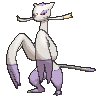
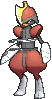
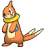

# Route 120 — Wild Pokémon

---

## [ Fortree ]

### Tall Grass

| Sprite | Pokémon | Encounter | Chance |
|:------:|---------|:---------:|--------|
|  | [Altaria](../../pokemon/altaria.md/) Lv. 38 |  Tall Grass | 10% |
|  | [Absol](../../pokemon/absol.md/) Lv. 38 |  Tall Grass | 10% |
|  | [Drifblim](../../pokemon/drifblim.md/) Lv. 38 |  Tall Grass | 10% |
|  | [Purugly](../../pokemon/purugly.md/) Lv. 38 |  Tall Grass | 10% |
|  | [Skuntank](../../pokemon/skuntank.md/) Lv. 38 |  Tall Grass | 10% |
|  | [Scrafty](../../pokemon/scrafty.md/) Lv. 38 |  Tall Grass | 10% |
|  | [Mienshao](../../pokemon/mienshao.md/) Lv. 38 |  Tall Grass | 10% |
|  | [Bisharp](../../pokemon/bisharp.md/) Lv. 38 |  Tall Grass | 10% |
|  | [Rufflet](../../pokemon/rufflet.md/) Lv. 38 |  Tall Grass | 10% |
|  | [Vullaby](../../pokemon/vullaby.md/) Lv. 38 |  Tall Grass | 10% |

### Horde

| Sprite | Pokémon | Encounter | Chance |
|:------:|---------|:---------:|--------|
|  | [Combusken](../../pokemon/combusken.md/) Lv. 30 |  Horde | 100% |

### Surfing

| Sprite | Pokémon | Encounter | Chance |
|:------:|---------|:---------:|--------|
|  | [Buizel](../../pokemon/buizel.md/) Lv. 30 - 40 |  Surfing | 50% |
|  | [Floatzel](../../pokemon/floatzel.md/) Lv. 30 - 40 |  Surfing | 50% |

### Old Rod

| Sprite | Pokémon | Encounter | Chance |
|:------:|---------|:---------:|--------|
|  | [Barboach](../../pokemon/barboach.md/) Lv. 15 |  Old Rod | 100% |

### Good Rod

| Sprite | Pokémon | Encounter | Chance |
|:------:|---------|:---------:|--------|
|  | [Barboach](../../pokemon/barboach.md/) Lv. 35 |  Good Rod | 100% |

### Super Rod

| Sprite | Pokémon | Encounter | Chance |
|:------:|---------|:---------:|--------|
|  | [Whiscash](../../pokemon/whiscash.md/) Lv. 55 |  Super Rod | 100% |

---

## [ Southwest ]

### Tall Grass

| Sprite | Pokémon | Encounter | Chance |
|:------:|---------|:---------:|--------|
|  | [Altaria](../../pokemon/altaria.md/) Lv. 44 |  Tall Grass | 10% |
|  | [Absol](../../pokemon/absol.md/) Lv. 44 |  Tall Grass | 10% |
|  | [Drifblim](../../pokemon/drifblim.md/) Lv. 44 |  Tall Grass | 10% |
|  | [Purugly](../../pokemon/purugly.md/) Lv. 44 |  Tall Grass | 10% |
|  | [Skuntank](../../pokemon/skuntank.md/) Lv. 44 |  Tall Grass | 10% |
|  | [Scrafty](../../pokemon/scrafty.md/) Lv. 44 |  Tall Grass | 10% |
|  | [Mienshao](../../pokemon/mienshao.md/) Lv. 44 |  Tall Grass | 10% |
|  | [Bisharp](../../pokemon/bisharp.md/) Lv. 44 |  Tall Grass | 10% |
|  | [Braviary](../../pokemon/braviary.md/) Lv. 44 |  Tall Grass | 10% |
|  | [Mandibuzz](../../pokemon/mandibuzz.md/) Lv. 44 |  Tall Grass | 10% |

### Horde

| Sprite | Pokémon | Encounter | Chance |
|:------:|---------|:---------:|--------|
|  | [Pawniard](../../pokemon/pawniard.md/) Lv. 25 |  Horde | 100% |

### Surfing

| Sprite | Pokémon | Encounter | Chance |
|:------:|---------|:---------:|--------|
|  | [Buizel](../../pokemon/buizel.md/) Lv. 35 - 45 |  Surfing | 50% |
|  | [Floatzel](../../pokemon/floatzel.md/) Lv. 35 - 45 |  Surfing | 50% |

### Old Rod

| Sprite | Pokémon | Encounter | Chance |
|:------:|---------|:---------:|--------|
|  | [Barboach](../../pokemon/barboach.md/) Lv. 15 |  Old Rod | 100% |

### Good Rod

| Sprite | Pokémon | Encounter | Chance |
|:------:|---------|:---------:|--------|
|  | [Barboach](../../pokemon/barboach.md/) Lv. 35 |  Good Rod | 100% |

### Super Rod

| Sprite | Pokémon | Encounter | Chance |
|:------:|---------|:---------:|--------|
|  | [Whiscash](../../pokemon/whiscash.md/) Lv. 55 |  Super Rod | 100% |

