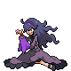
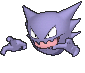
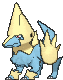

# Route 121 — Trainer Pokémon

---

## [ Main Area ]

### Trainer Rosters

| Trainer | P1 | P2 | P3 |
|:-------:|:--:|:--:|:--:|
|  Hex Maniac Tammy [326] | 
 [Haunter](../../pokemon/haunter.md) Lv. 47
 | 
 [Misdreavus](../../pokemon/misdreavus.md) Lv. 47
 | 
 [Banette](../../pokemon/banette.md) Lv. 47
 |
|  Beauty Jessica [593] | 
 [Seviper](../../pokemon/seviper.md) Lv. 47
 | 
 [Krookodile](../../pokemon/krookodile.md) Lv. 47
 | 
 [Absol](../../pokemon/absol.md) Lv. 47
 |
|  Gentleman Walter [327] | 
 [Manectric](../../pokemon/manectric.md) Lv. 47
 | 
 [Arcanine](../../pokemon/arcanine.md) Lv. 47
 | 
 [Ampharos](../../pokemon/ampharos.md) Lv. 47
 |
|  Poké Fan Vanessa [645] | 
 [Granbull](../../pokemon/granbull.md) Lv. 47
 | 
 [Meowstic](../../pokemon/meowstic-male.md) Lv. 47
 | 
 [Glaceon](../../pokemon/glaceon.md) Lv. 47
 |
|  Teammates Kate & Joy [584] | 
 [Spinda](../../pokemon/spinda.md) Lv. 49
 | 
 [Slaking](../../pokemon/slaking.md) Lv. 50
 |

### Rematches

| Trainer | P1 | P2 | P3 | P4 |
|:-------:|:--:|:--:|:--:|:--:|
| ") Beauty Jessica (7) [627] | 
 [Seviper](../../pokemon/seviper.md) Lv. 59
 | 
 [Krookodile](../../pokemon/krookodile.md) Lv. 59
 | 
 [Absol](../../pokemon/absol.md) Lv. 59
 | 
 [Dragalge](../../pokemon/dragalge.md) Lv. 59
 |
| ") Beauty Jessica (8) [628] | 
 [Seviper](../../pokemon/seviper.md) Lv. 64
 | 
 [Krookodile](../../pokemon/krookodile.md) Lv. 64
 | 
 [Absol](../../pokemon/absol.md) Lv. 64
 | 
 [Dragalge](../../pokemon/dragalge.md) Lv. 64
 |
| ") Beauty Jessica (C) [629] | 
 [Seviper](../../pokemon/seviper.md) Lv. 75
 | 
 [Krookodile](../../pokemon/krookodile.md) Lv. 75
 | 
 [Absol](../../pokemon/absol.md) Lv. 75
 | 
 [Dragalge](../../pokemon/dragalge.md) Lv. 75
 |
| ") Gentleman Walter (7) [444] | 
 [Manectric](../../pokemon/manectric.md) Lv. 59
 | 
 [Arcanine](../../pokemon/arcanine.md) Lv. 59
 | 
 [Ampharos](../../pokemon/ampharos.md) Lv. 59
 | 
 [Stoutland](../../pokemon/stoutland.md) Lv. 59
 |
| ") Gentleman Walter (8) [610] | 
 [Manectric](../../pokemon/manectric.md) Lv. 64
 | 
 [Arcanine](../../pokemon/arcanine.md) Lv. 64
 | 
 [Ampharos](../../pokemon/ampharos.md) Lv. 64
 | 
 [Stoutland](../../pokemon/stoutland.md) Lv. 64
 |
| ") Gentleman Walter (C) [611] | 
 [Manectric](../../pokemon/manectric.md) Lv. 75
 | 
 [Arcanine](../../pokemon/arcanine.md) Lv. 75
 | 
 [Ampharos](../../pokemon/ampharos.md) Lv. 75
 | 
 [Stoutland](../../pokemon/stoutland.md) Lv. 75
 |

