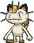

# Route 121 — Wild Pokémon

## [ Main Area ]

### Grass

| Sprite | Pokémon | Encounter | Chance |
|:------:|---------|:---------:|--------|
|  | [Meowth](../../pokemon/meowth.md/) Lv. 40 |  Grass | 10% |
|  | [Ponyta](../../pokemon/ponyta.md/) Lv. 40 |  Grass | 10% |
|  | [Doduo](../../pokemon/doduo.md/) Lv. 40 |  Grass | 10% |
|  | [Drowzee](../../pokemon/drowzee.md/) Lv. 40 |  Grass | 10% |
|  | [Flaaffy](../../pokemon/flaaffy.md/) Lv. 40 |  Grass | 10% |
|  | [Mightyena](../../pokemon/mightyena.md/) Lv. 40 |  Grass | 10% |
|  | [Shuppet](../../pokemon/shuppet.md/) Lv. 40 |  Grass | 10% |
|  | [Herdier](../../pokemon/herdier.md/) Lv. 40 |  Grass | 10% |
|  | [Blitzle](../../pokemon/blitzle.md/) Lv. 40 |  Grass | 10% |
|  | [Diggersby](../../pokemon/diggersby.md/) Lv. 40 |  Grass | 10% |

### Tall Grass

| Sprite | Pokémon | Encounter | Chance |
|:------:|---------|:---------:|--------|
|  | [Persian](../../pokemon/persian.md/) Lv. 44 |  Tall Grass | 10% |
|  | [Rapidash](../../pokemon/rapidash.md/) Lv. 44 |  Tall Grass | 10% |
|  | [Dodrio](../../pokemon/dodrio.md/) Lv. 44 |  Tall Grass | 10% |
|  | [Hypno](../../pokemon/hypno.md/) Lv. 44 |  Tall Grass | 10% |
|  | [Flaaffy](../../pokemon/flaaffy.md/) Lv. 44 |  Tall Grass | 10% |
|  | [Mightyena](../../pokemon/mightyena.md/) Lv. 44 |  Tall Grass | 10% |
|  | [Banette](../../pokemon/banette.md/) Lv. 44 |  Tall Grass | 10% |
|  | [Herdier](../../pokemon/herdier.md/) Lv. 44 |  Tall Grass | 10% |
|  | [Zebstrika](../../pokemon/zebstrika.md/) Lv. 44 |  Tall Grass | 10% |
|  | [Diggersby](../../pokemon/diggersby.md/) Lv. 44 |  Tall Grass | 10% |

### DexNav

| Sprite | Pokémon | Encounter | Chance |
|:------:|---------|:---------:|--------|
|  | [Stoutland](../../pokemon/stoutland.md/) Lv. 50 |  DexNav | 100% |

### Horde

| Sprite | Pokémon | Encounter | Chance |
|:------:|---------|:---------:|--------|
|  | [Drowzee](../../pokemon/drowzee.md/) Lv. 26 |  Horde | 100% |

