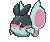

# Route 122 — Wild Pokémon

---

## [ Main Area ]

### DexNav

| Sprite | Pokémon | Encounter | Chance |
|:------:|---------|:---------:|--------|
|  | [Alomomola](../../pokemon/alomomola.md/) Lv. 50 |  DexNav | 100% |

### Surfing

| Sprite | Pokémon | Encounter | Chance |
|:------:|---------|:---------:|--------|
|  | [Frillish](../../pokemon/frillish.md/) Lv. 35 - 45 |  Surfing | 50% |
|  | [Jellicent](../../pokemon/jellicent.md/) Lv. 35 - 45 |  Surfing | 50% |

### Old Rod

| Sprite | Pokémon | Encounter | Chance |
|:------:|---------|:---------:|--------|
|  | [Finneon](../../pokemon/finneon.md/) Lv. 15 |  Old Rod | 100% |

### Good Rod

| Sprite | Pokémon | Encounter | Chance |
|:------:|---------|:---------:|--------|
|  | [Finneon](../../pokemon/finneon.md/) Lv. 35 |  Good Rod | 100% |

### Super Rod

| Sprite | Pokémon | Encounter | Chance |
|:------:|---------|:---------:|--------|
|  | [Lumineon](../../pokemon/lumineon.md/) Lv. 55 |  Super Rod | 100% |

