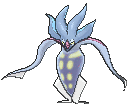

# Route 123 — Trainer Pokémon

---

## [ Main Area ]

### Trainer Rosters

### Rematches

| Trainer | P1 | P2 | P3 | P4 |
|:-------:|:--:|:--:|:--:|:--:|
| ") Psychic Cameron (7) [445] | 
 [Malamar](../../pokemon/malamar.md) Lv. 59
 | 
 [Grumpig](../../pokemon/grumpig.md) Lv. 59
 | 
 [Musharna](../../pokemon/musharna.md) Lv. 59
 | 
 [Solrock](../../pokemon/solrock.md) Lv. 59
 |
| ") Psychic Cameron (8) [446] | 
 [Malamar](../../pokemon/malamar.md) Lv. 64
 | 
 [Grumpig](../../pokemon/grumpig.md) Lv. 64
 | 
 [Musharna](../../pokemon/musharna.md) Lv. 64
 | 
 [Solrock](../../pokemon/solrock.md) Lv. 64
 |
| ") Psychic Cameron (C) [447] | 
 [Malamar](../../pokemon/malamar.md) Lv. 75
 | 
 [Grumpig](../../pokemon/grumpig.md) Lv. 75
 | 
 [Musharna](../../pokemon/musharna.md) Lv. 75
 | 
 [Solrock](../../pokemon/solrock.md) Lv. 75
 |

