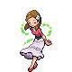
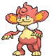
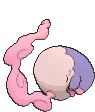
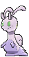
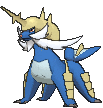

# Route 123 — Trainer Pokémon

---

## [ Main Area ]

### Trainer Rosters

| Trainer | P1 | P2 | P3 | P4 |
|:-------:|:--:|:--:|:--:|:--:|
|  Aroma Lady Violet [319] | 
 [Gloom](../../pokemon/gloom.md) Lv. 39
 | 
 [Vileplume](../../pokemon/vileplume.md) Lv. 39
 | 
 [Bellossom](../../pokemon/bellossom.md) Lv. 39
 |
|  Twins Miu & Yuki [276] | 
 [Simisear](../../pokemon/simisear.md) Lv. 41
 | 
 [Simisage](../../pokemon/simisage.md) Lv. 41
 |
|  Psychic Cameron [321] | 
 [Malamar](../../pokemon/malamar.md) Lv. 50
 | 
 [Grumpig](../../pokemon/grumpig.md) Lv. 50
 | 
 [Musharna](../../pokemon/musharna.md) Lv. 50
 |
|  Picnicker Martha [219] | 
 [Leafeon](../../pokemon/leafeon.md) Lv. 49
 | 
 [Piloswine](../../pokemon/piloswine.md) Lv. 49
 | 
 [Sliggoo](../../pokemon/sliggoo.md) Lv. 49
 |
|  Street Thug Hannibal [792] | 
 [Doublade](../../pokemon/doublade.md) Lv. 50
 | 
 [Muk](../../pokemon/muk.md) Lv. 50
 | 
 [Garbodor](../../pokemon/garbodor.md) Lv. 50
 |
|  Delinquent Kylie [801] | 
 [Victreebel](../../pokemon/victreebel.md) Lv. 50
 | 
 [Umbreon](../../pokemon/umbreon.md) Lv. 50
 | 
 [Bisharp](../../pokemon/bisharp.md) Lv. 50
 |
|  Ace Trainer Clyde [581] | 
 [Haxorus](../../pokemon/haxorus.md) Lv. 50
 | 
 [Rhyperior](../../pokemon/rhyperior.md) Lv. 50
 | 
 [Blaziken](../../pokemon/blaziken.md) Lv. 50
 | 
 [Gengar](../../pokemon/gengar.md) Lv. 50
 |
|  Ace Trainer Julie [352] | 
 [Stantler](../../pokemon/stantler.md) Lv. 50
 | 
 [Typhlosion](../../pokemon/typhlosion.md) Lv. 50
 | 
 [Klinklang](../../pokemon/klinklang.md) Lv. 50
 | 
 [Lilligant](../../pokemon/lilligant.md) Lv. 50
 |
|  Ace Trainer Wendy [580] | 
 [Gothitelle](../../pokemon/gothitelle.md) Lv. 50
 | 
 [Samurott](../../pokemon/samurott.md) Lv. 50
 | 
 [Volcarona](../../pokemon/volcarona.md) Lv. 50
 | 
 [Roserade](../../pokemon/roserade.md) Lv. 50
 |
|  Fisherman Timin [774] | 
 [Seaking](../../pokemon/seaking.md) Lv. 51
 |
|  Fisherman Fisher [776] | 
 [Whiscash](../../pokemon/whiscash.md) Lv. 51
 |
|  Fisherman Finley [775] | 
 its shell regularly. Immediately after molting, its shell is soft and tender. Until the shell hardens, this Pokémon hides in its streambed burrow to avoid attack from its foes.") [Crawdaunt](../../pokemon/crawdaunt.md) Lv. 51
 |

### Rematches

| Trainer | P1 | P2 | P3 | P4 |
|:-------:|:--:|:--:|:--:|:--:|
| ") Psychic Cameron (7) [445] | 
 [Malamar](../../pokemon/malamar.md) Lv. 59
 | 
 [Grumpig](../../pokemon/grumpig.md) Lv. 59
 | 
 [Musharna](../../pokemon/musharna.md) Lv. 59
 | 
 [Solrock](../../pokemon/solrock.md) Lv. 59
 |
| ") Psychic Cameron (8) [446] | 
 [Malamar](../../pokemon/malamar.md) Lv. 64
 | 
 [Grumpig](../../pokemon/grumpig.md) Lv. 64
 | 
 [Musharna](../../pokemon/musharna.md) Lv. 64
 | 
 [Solrock](../../pokemon/solrock.md) Lv. 64
 |
| ") Psychic Cameron (C) [447] | 
 [Malamar](../../pokemon/malamar.md) Lv. 75
 | 
 [Grumpig](../../pokemon/grumpig.md) Lv. 75
 | 
 [Musharna](../../pokemon/musharna.md) Lv. 75
 | 
 [Solrock](../../pokemon/solrock.md) Lv. 75
 |

