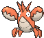

# Route 123 — Wild Pokémon

### Tall Grass

| Sprite | Pokémon | Encounter Type | Chance |
|:------:|---------|:--------------:|--------|
|  | [Parasect](../../pokemon/parasect.md/) Lv. 45 |  Tall Grass | 10% |
|  | [Venomoth](../../pokemon/venomoth.md/) Lv. 45 |  Tall Grass | 10% |
|  | [Dugtrio](../../pokemon/dugtrio.md/) Lv. 45 |  Tall Grass | 10% |
|  | [Primeape](../../pokemon/primeape.md/) Lv. 45 |  Tall Grass | 10% |
|  | [Machoke](../../pokemon/machoke.md/) Lv. 45 |  Tall Grass | 10% |
|  | [Forretress](../../pokemon/forretress.md/) Lv. 45 |  Tall Grass | 10% |
|  | [Granbull](../../pokemon/granbull.md/) Lv. 45 |  Tall Grass | 10% |
|  | [Kecleon](../../pokemon/kecleon.md/) Lv. 45 |  Tall Grass | 10% |
|  | [Liepard](../../pokemon/liepard.md/) Lv. 45 |  Tall Grass | 10% |
|  | [Pangoro](../../pokemon/pangoro.md/) Lv. 45 |  Tall Grass | 10% |

### Horde

| Sprite | Pokémon | Encounter Type | Chance |
|:------:|---------|:--------------:|--------|
|  | [Machop](../../pokemon/machop.md/) Lv. 30 |  Horde | 100% |

### Surfing

| Sprite | Pokémon | Encounter Type | Chance |
|:------:|---------|:--------------:|--------|
|  | [Marill](../../pokemon/marill.md/) Lv. 35 - 45 |  Surfing | 50% |
|  | [Azumarill](../../pokemon/azumarill.md/) Lv. 35 - 45 |  Surfing | 50% |

### Old Rod

| Sprite | Pokémon | Encounter Type | Chance |
|:------:|---------|:--------------:|--------|
|  | [Corphish](../../pokemon/corphish.md/) Lv. 15 |  Old Rod | 100% |

### Good Rod

| Sprite | Pokémon | Encounter Type | Chance |
|:------:|---------|:--------------:|--------|
|  | [Corphish](../../pokemon/corphish.md/) Lv. 35 |  Good Rod | 100% |

### Super Rod

| Sprite | Pokémon | Encounter Type | Chance |
|:------:|---------|:--------------:|--------|
|  its shell regularly. Immediately after molting, its shell is soft and tender. Until the shell hardens, this Pokémon hides in its streambed burrow to avoid attack from its foes.") | [Crawdaunt](../../pokemon/crawdaunt.md/) Lv. 55 |  Super Rod | 100% |

