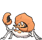

# Route 124 — Trainer Pokémon

## [ Main Area ]

### Trainer Rosters

### Rematches

| Trainer | P1 | P2 | P3 | P4 |
|:-------:|:--:|:--:|:--:|:--:|
| ") Swimmer Jenny (8) [507] | 
 [Luvdisc](../../pokemon/luvdisc.md) Lv. 64
 | 
 [Corsola](../../pokemon/corsola.md) Lv. 64
 | 
 [Alomomola](../../pokemon/alomomola.md) Lv. 64
 | 
 [Gorebyss](../../pokemon/gorebyss.md) Lv. 64
 |
| ") Swimmer Jenny (C) [508] | 
 [Luvdisc](../../pokemon/luvdisc.md) Lv. 75
 | 
 [Corsola](../../pokemon/corsola.md) Lv. 75
 | 
 [Alomomola](../../pokemon/alomomola.md) Lv. 75
 | 
 [Gorebyss](../../pokemon/gorebyss.md) Lv. 75
 |
| ") Sis & Bro Rita & Sam (7) [546] | 
 [Empoleon](../../pokemon/empoleon.md) Lv. 59
 | 
 [Samurott](../../pokemon/samurott.md) Lv. 60
 |
| ") Sis & Bro Rita & Sam (8) [547] | 
 [Empoleon](../../pokemon/empoleon.md) Lv. 65
 | 
 [Samurott](../../pokemon/samurott.md) Lv. 66
 | 
 [Feraligatr](../../pokemon/feraligatr.md) Lv. 65
 | 
 [Blastoise](../../pokemon/blastoise.md) Lv. 66
 |
| ") Sis & Bro Rita & Sam (C) [548] | 
 [Empoleon](../../pokemon/empoleon.md) Lv. 75
 | 
 [Samurott](../../pokemon/samurott.md) Lv. 76
 | 
 [Feraligatr](../../pokemon/feraligatr.md) Lv. 75
 | 
 [Blastoise](../../pokemon/blastoise.md) Lv. 76
 |

## [ Underwater ]

### Trainer Rosters

### Rematches

| Trainer | P1 | P2 | P3 | P4 |
|:-------:|:--:|:--:|:--:|:--:|
| ") Scuba Diver Kylan (8) [746] | 
 [Kingdra](../../pokemon/kingdra.md) Lv. 64
 | 
 [Kingler](../../pokemon/kingler.md) Lv. 64
 | 
 [Clawitzer](../../pokemon/clawitzer.md) Lv. 64
 | 
 [Relicanth](../../pokemon/relicanth.md) Lv. 64
 |
| ") Scuba Diver Kylan (C) [747] | 
 [Kingdra](../../pokemon/kingdra.md) Lv. 75
 | 
 [Kingler](../../pokemon/kingler.md) Lv. 75
 | 
 [Clawitzer](../../pokemon/clawitzer.md) Lv. 75
 | 
 [Relicanth](../../pokemon/relicanth.md) Lv. 75
 |
| ") Free Diver Arzu (8) [759] | 
 [Huntail](../../pokemon/huntail.md) Lv. 64
 | 
 [Gorebyss](../../pokemon/gorebyss.md) Lv. 64
 | 
 [Milotic](../../pokemon/milotic.md) Lv. 64
 | 
 [Gyarados](../../pokemon/gyarados.md) Lv. 64
 |
| ") Free Diver Arzu (C) [760] | 
 [Huntail](../../pokemon/huntail.md) Lv. 75
 | 
 [Gorebyss](../../pokemon/gorebyss.md) Lv. 75
 | 
 [Milotic](../../pokemon/milotic.md) Lv. 75
 | 
 [Gyarados](../../pokemon/gyarados.md) Lv. 75
 |

