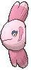
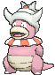

# Route 124 — Trainer Pokémon

---

## [ Main Area ]

### Trainer Rosters

| Trainer | P1 | P2 | P3 |
|:-------:|:--:|:--:|:--:|
|  Swimmer Jenny [143] | 
 [Luvdisc](../../pokemon/luvdisc.md) Lv. 53
 | 
 [Corsola](../../pokemon/corsola.md) Lv. 53
 | 
 [Alomomola](../../pokemon/alomomola.md) Lv. 53
 |
|  Swimmer Roland [131] | 
 [Kabutops](../../pokemon/kabutops.md) Lv. 53
 | 
 [Poliwrath](../../pokemon/poliwrath.md) Lv. 53
 | 
 [Octillery](../../pokemon/octillery.md) Lv. 53
 |
|  Swimmer Grace [144] | 
 [Azumarill](../../pokemon/azumarill.md) Lv. 54
 | 
 [Politoed](../../pokemon/politoed.md) Lv. 54
 |
|  Sis & Bro Rita & Sam [545] | 
 [Empoleon](../../pokemon/empoleon.md) Lv. 55
 | 
 [Samurott](../../pokemon/samurott.md) Lv. 56
 |
|  Swimmer Spencer [130] | 
 [Pelipper](../../pokemon/pelipper.md) Lv. 53
 | 
 [Tentacruel](../../pokemon/tentacruel.md) Lv. 53
 | 
 [Whiscash](../../pokemon/whiscash.md) Lv. 53
 |
|  Swimmer Chad [193] | 
 [Golduck](../../pokemon/golduck.md) Lv. 53
 | 
 [Slowking](../../pokemon/slowking.md) Lv. 53
 | 
 [Bibarel](../../pokemon/bibarel.md) Lv. 53
 |

### Rematches

| Trainer | P1 | P2 | P3 | P4 |
|:-------:|:--:|:--:|:--:|:--:|
| ") Swimmer Jenny (8) [507] | 
 [Luvdisc](../../pokemon/luvdisc.md) Lv. 64
 | 
 [Corsola](../../pokemon/corsola.md) Lv. 64
 | 
 [Alomomola](../../pokemon/alomomola.md) Lv. 64
 | 
 [Gorebyss](../../pokemon/gorebyss.md) Lv. 64
 |
| ") Swimmer Jenny (C) [508] | 
 [Luvdisc](../../pokemon/luvdisc.md) Lv. 75
 | 
 [Corsola](../../pokemon/corsola.md) Lv. 75
 | 
 [Alomomola](../../pokemon/alomomola.md) Lv. 75
 | 
 [Gorebyss](../../pokemon/gorebyss.md) Lv. 75
 |
| ") Sis & Bro Rita & Sam (7) [546] | 
 [Empoleon](../../pokemon/empoleon.md) Lv. 59
 | 
 [Samurott](../../pokemon/samurott.md) Lv. 60
 |
| ") Sis & Bro Rita & Sam (8) [547] | 
 [Empoleon](../../pokemon/empoleon.md) Lv. 65
 | 
 [Samurott](../../pokemon/samurott.md) Lv. 66
 | 
 [Feraligatr](../../pokemon/feraligatr.md) Lv. 65
 | 
 [Blastoise](../../pokemon/blastoise.md) Lv. 66
 |
| ") Sis & Bro Rita & Sam (C) [548] | 
 [Empoleon](../../pokemon/empoleon.md) Lv. 75
 | 
 [Samurott](../../pokemon/samurott.md) Lv. 76
 | 
 [Feraligatr](../../pokemon/feraligatr.md) Lv. 75
 | 
 [Blastoise](../../pokemon/blastoise.md) Lv. 76
 |

---

## [ Underwater ]

### Trainer Rosters

| Trainer | P1 | P2 |
|:-------:|:--:|:--:|
|  Scuba Diver Kylan [737] | 
 [Kingdra](../../pokemon/kingdra.md) Lv. 60
 |
|  Free Diver Rischel [751] | 
 [Seaking](../../pokemon/seaking.md) Lv. 60
 |
|  Scuba Diver Dmitry [738] | 
 [Starmie](../../pokemon/starmie.md) Lv. 60
 |
|  Free Diver Arzu [750] | 
 [Huntail](../../pokemon/huntail.md) Lv. 59
 | 
 [Gorebyss](../../pokemon/gorebyss.md) Lv. 59
 |

### Rematches

| Trainer | P1 | P2 | P3 | P4 |
|:-------:|:--:|:--:|:--:|:--:|
| ") Scuba Diver Kylan (8) [746] | 
 [Kingdra](../../pokemon/kingdra.md) Lv. 64
 | 
 [Kingler](../../pokemon/kingler.md) Lv. 64
 | 
 [Clawitzer](../../pokemon/clawitzer.md) Lv. 64
 | 
 [Relicanth](../../pokemon/relicanth.md) Lv. 64
 |
| ") Scuba Diver Kylan (C) [747] | 
 [Kingdra](../../pokemon/kingdra.md) Lv. 75
 | 
 [Kingler](../../pokemon/kingler.md) Lv. 75
 | 
 [Clawitzer](../../pokemon/clawitzer.md) Lv. 75
 | 
 [Relicanth](../../pokemon/relicanth.md) Lv. 75
 |
| ") Free Diver Arzu (8) [759] | 
 [Huntail](../../pokemon/huntail.md) Lv. 64
 | 
 [Gorebyss](../../pokemon/gorebyss.md) Lv. 64
 | 
 [Milotic](../../pokemon/milotic.md) Lv. 64
 | 
 [Gyarados](../../pokemon/gyarados.md) Lv. 64
 |
| ") Free Diver Arzu (C) [760] | 
 [Huntail](../../pokemon/huntail.md) Lv. 75
 | 
 [Gorebyss](../../pokemon/gorebyss.md) Lv. 75
 | 
 [Milotic](../../pokemon/milotic.md) Lv. 75
 | 
 [Gyarados](../../pokemon/gyarados.md) Lv. 75
 |

