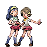
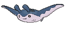

# Route 125 — Trainer Pokémon

---

## [ Main Area ]

### Trainer Rosters

| Trainer | P1 | P2 | P3 |
|:-------:|:--:|:--:|:--:|
|  Sailor Ernest [194] | 
 [Gastrodon](../../pokemon/gastrodon.md) Lv. 54
 | 
 [Machamp](../../pokemon/machamp.md) Lv. 54
 | 
 [Raticate](../../pokemon/raticate.md) Lv. 54
 |
|  Teammates Kim & Iris [631] | 
 [Altaria](../../pokemon/altaria.md) Lv. 56
 | 
 [Charizard](../../pokemon/charizard.md) Lv. 57
 |
|  Swimmer Stan [133] | 
 [Carracosta](../../pokemon/carracosta.md) Lv. 55
 | 
 [Clawitzer](../../pokemon/clawitzer.md) Lv. 55
 |
|  Swimmer Tanya [145] | 
 [Floatzel](../../pokemon/floatzel.md) Lv. 55
 | 
 [Mantine](../../pokemon/mantine.md) Lv. 55
 |
|  Swimmer Sharon [146] | 
 [Lapras](../../pokemon/lapras.md) Lv. 56
 |
|  Swimmer Cody [132] | 
 [Feraligatr](../../pokemon/feraligatr.md) Lv. 55
 | 
 [Ludicolo](../../pokemon/ludicolo.md) Lv. 55
 |

### Rematches

| Trainer | P1 | P2 | P3 | P4 |
|:-------:|:--:|:--:|:--:|:--:|
| ") Sailor Ernest (8) [453] | 
 [Gastrodon](../../pokemon/gastrodon.md) Lv. 64
 | 
 [Machamp](../../pokemon/machamp.md) Lv. 64
 | 
 [Raticate](../../pokemon/raticate.md) Lv. 64
 | 
 [Kingler](../../pokemon/kingler.md) Lv. 64
 |
| ") Sailor Ernest (C) [454] | 
 [Gastrodon](../../pokemon/gastrodon.md) Lv. 75
 | 
 [Machamp](../../pokemon/machamp.md) Lv. 75
 | 
 [Raticate](../../pokemon/raticate.md) Lv. 75
 | 
 [Kingler](../../pokemon/kingler.md) Lv. 75
 |

