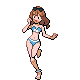
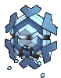
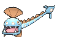
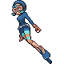

# Route 126 — Trainer Pokémon

## [ Main Area ]

### Trainer Rosters

| Trainer | P1 | P2 | P3 | P4 |
|:-------:|:--:|:--:|:--:|:--:|
|  Triathlete Swimmer Denzel [718] | 
 [Starmie](../../pokemon/starmie.md) Lv. 55
 | 
 [Sharpedo](../../pokemon/sharpedo.md) Lv. 55
 |
|  Swimmer Barry [134] | 
 [Gyarados](../../pokemon/gyarados.md) Lv. 56
 |
|  Swimmer Dean [135] | 
 [Wailord](../../pokemon/wailord.md) Lv. 55
 | 
 [Barbaracle](../../pokemon/barbaracle.md) Lv. 55
 |
|  Ace Trainer Harriet [817] | 
 [Froslass](../../pokemon/froslass.md) Lv. 55
 | 
 [Magmortar](../../pokemon/magmortar.md) Lv. 55
 | 
 [Sceptile](../../pokemon/sceptile.md) Lv. 55
 | 
 [Kingdra](../../pokemon/kingdra.md) Lv. 55
 |
|  Ace Trainer Leopold [809] | 
 [Blastoise](../../pokemon/blastoise.md) Lv. 55
 | 
 [Golurk](../../pokemon/golurk.md) Lv. 55
 | 
 [Electivire](../../pokemon/electivire.md) Lv. 55
 | 
 [Cryogonal](../../pokemon/cryogonal.md) Lv. 55
 |
|  Swimmer Brenda [148] | 
 [Masquerain](../../pokemon/masquerain.md) Lv. 55
 | 
 [Gorebyss](../../pokemon/gorebyss.md) Lv. 55
 |
|  Swimmer Nikki [147] | 
 [Huntail](../../pokemon/huntail.md) Lv. 54
 | 
 [Lumineon](../../pokemon/lumineon.md) Lv. 54
 | 
 [Swanna](../../pokemon/swanna.md) Lv. 54
 |

## [ Underwater ]

### Trainer Rosters

| Trainer | P1 |
|:-------:|:--:|
|  Scuba Diver Tristan [741] | 
 [Clawitzer](../../pokemon/clawitzer.md) Lv. 60
 |
|  Scuba Diver Yukata [740] | 
 [Pelipper](../../pokemon/pelipper.md) Lv. 60
 |
|  Free Diver Jillian [753] | 
 [Azumarill](../../pokemon/azumarill.md) Lv. 60
 |

