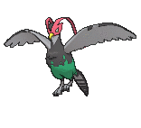
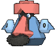
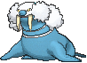

# Route 127 — Trainer Pokémon

---

## [ Main Area ]

### Trainer Rosters

| Trainer | P1 | P2 | P3 | P4 |
|:-------:|:--:|:--:|:--:|:--:|
|  Bird Keeper Byron [540] | 
 [Skarmory](../../pokemon/skarmory.md) Lv. 54
 | 
 [Sigilyph](../../pokemon/sigilyph.md) Lv. 54
 | 
 [Unfezant](../../pokemon/unfezant.md) Lv. 54
 |
|  Ace Trainer Hisato [807] | 
 [Mamoswine](../../pokemon/mamoswine.md) Lv. 55
 | 
 [Wobbuffet](../../pokemon/wobbuffet.md) Lv. 55
 | 
 [Aegislash](../../pokemon/aegislash-shield.md) Lv. 55
 | 
 [Kingdra](../../pokemon/kingdra.md) Lv. 55
 |
|  Ace Trainer Claudia [816] | 
 [Swampert](../../pokemon/swampert.md) Lv. 55
 | 
 [Metang](../../pokemon/metang.md) Lv. 55
 | 
 [Probopass](../../pokemon/probopass.md) Lv. 55
 | 
 [Beartic](../../pokemon/beartic.md) Lv. 55
 |
|  Fisherman Jonah [533] | 
 [Relicanth](../../pokemon/relicanth.md) Lv. 56
 |
|  Fisherman Henry [534] | 
 [Lanturn](../../pokemon/lanturn.md) Lv. 56
 |
|  Fisherman Roger [535] | 
 [Kingler](../../pokemon/kingler.md) Lv. 56
 |
|  Black Belt Koji [538] | 
 [Infernape](../../pokemon/infernape.md) Lv. 55
 | 
 [Heracross](../../pokemon/heracross.md) Lv. 55
 | 
 [Emboar](../../pokemon/emboar.md) Lv. 55
 |
|  Triathlete Swimmer Jaylon [717] | 
 [Floatzel](../../pokemon/floatzel.md) Lv. 56
 |

---

## [ Underwater ]

### Trainer Rosters

| Trainer | P1 |
|:-------:|:--:|
|  Scuba Diver Javier [745] | 
 [Relicanth](../../pokemon/relicanth.md) Lv. 60
 |
|  Free Diver Kailyn [757] | 
 [Alomomola](../../pokemon/alomomola.md) Lv. 60
 |
|  Free Diver Aileen [758] | 
 [Walrein](../../pokemon/walrein.md) Lv. 60
 |

