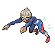

# Route 128 — Trainer Pokémon

---

## [ Main Area ]

### Trainer Rosters

| Trainer | P1 | P2 | P3 | P4 |
|:-------:|:--:|:--:|:--:|:--:|
|  Ace Trainer Cornelius [808] | 
 [Spiritomb](../../pokemon/spiritomb.md) Lv. 55
 | 
 [Noivern](../../pokemon/noivern.md) Lv. 55
 | 
 [Glalie](../../pokemon/glalie.md) Lv. 55
 | 
 [Eelektross](../../pokemon/eelektross.md) Lv. 55
 |
|  Fisherman Wayne [539] | 
 [Wailord](../../pokemon/wailord.md) Lv. 56
 |
|  Triathlete Swimmer Isaiah [165] | 
 [Lumineon](../../pokemon/lumineon.md) Lv. 56
 |
|  Tuber Delmar [827] | 
 [Palpitoad](../../pokemon/palpitoad.md) Lv. 56
 |
|  Tuber Marlene [828] | 
 [Poliwhirl](../../pokemon/poliwhirl.md) Lv. 56
 |

### Rematches

| Trainer | P1 | P2 | P3 | P4 |
|:-------:|:--:|:--:|:--:|:--:|
| ") Triathlete Swimmer Isaiah (7) [484] | 
 [Lumineon](../../pokemon/lumineon.md) Lv. 59
 | 
 [Starmie](../../pokemon/starmie.md) Lv. 59
 | 
 [Floatzel](../../pokemon/floatzel.md) Lv. 59
 | 
 [Kingdra](../../pokemon/kingdra.md) Lv. 59
 |
| ") Triathlete Swimmer Isaiah (8) [485] | 
 [Lumineon](../../pokemon/lumineon.md) Lv. 64
 | 
 [Starmie](../../pokemon/starmie.md) Lv. 64
 | 
 [Floatzel](../../pokemon/floatzel.md) Lv. 64
 | 
 [Kingdra](../../pokemon/kingdra.md) Lv. 64
 |
| ") Triathlete Swimmer Isaiah (C) [486] | 
 [Lumineon](../../pokemon/lumineon.md) Lv. 75
 | 
 [Starmie](../../pokemon/starmie.md) Lv. 75
 | 
 [Floatzel](../../pokemon/floatzel.md) Lv. 75
 | 
 [Kingdra](../../pokemon/kingdra.md) Lv. 75
 |

---

## [ Underwater ]

### Trainer Rosters

| Trainer | P1 |
|:-------:|:--:|
|  Free Diver Mayu [754] | 
 [Luvdisc](../../pokemon/luvdisc.md) Lv. 60
 |

