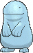
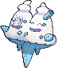

# Route 129 — Trainer Pokémon

### Generic Trainers

| Trainer | P1 | P2 | P3 | P4 |
|:-------:|:--:|:--:|:--:|:--:|
|  Fisherman Fisk [778] | 
 [Dragalge](../../pokemon/dragalge.md) Lv. 56
 |
|  Fisherman Sheaffer [777] | 
 [Qwilfish](../../pokemon/qwilfish.md) Lv. 56
 |
|  Swimmer Reed [541] | 
 [Seismitoad](../../pokemon/seismitoad.md) Lv. 54
 | 
 [Whiscash](../../pokemon/whiscash.md) Lv. 54
 | 
 [Quagsire](../../pokemon/quagsire.md) Lv. 54
 |
|  Ace Trainer Honor [818] | 
 [Vanilluxe](../../pokemon/vanilluxe.md) Lv. 55
 | 
 [Gigalith](../../pokemon/gigalith.md) Lv. 55
 | 
 [Simisage](../../pokemon/simisage.md) Lv. 55
 | 
 [Omastar](../../pokemon/omastar.md) Lv. 55
 |
|  Swimmer Tisha [542] | 
 [Politoed](../../pokemon/politoed.md) Lv. 55
 | 
 [Simipour](../../pokemon/simipour.md) Lv. 55
 |
|  Triathlete Swimmer Chase [167] | 
 [Kingdra](../../pokemon/kingdra.md) Lv. 56
 |

## [ Underwater ]

### Generic Trainers

| Trainer | P1 |
|:-------:|:--:|
|  Scuba Diver Colten [744] | 
 [Golduck](../../pokemon/golduck.md) Lv. 60
 |
|  Scuba Diver Jason [743] | 
 [Gyarados](../../pokemon/gyarados.md) Lv. 60
 |
|  Free Diver Coral [756] | 
 [Tentacruel](../../pokemon/tentacruel.md) Lv. 60
 |

