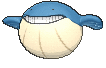

# Route 129 — Wild Pokémon

## [ Main Area ]

### DexNav

| Sprite | Pokémon | Encounter | Chance |
|:------:|---------|:---------:|--------|
|  | [Alomomola](../../pokemon/alomomola.md/) Lv. 50 |  DexNav | 100% |

### Surfing

| Sprite | Pokémon | Encounter | Chance |
|:------:|---------|:---------:|--------|
|  | [Wailmer](../../pokemon/wailmer.md/) Lv. 40 - 50 |  Surfing | 50% |
|  | [Wailord](../../pokemon/wailord.md/) Lv. 40 - 50 |  Surfing | 50% |

### Old Rod

| Sprite | Pokémon | Encounter | Chance |
|:------:|---------|:---------:|--------|
|  | [Wailmer](../../pokemon/wailmer.md/) Lv. 15 |  Old Rod | 50% |
|  | [Relicanth](../../pokemon/relicanth.md/) Lv. 15 |  Old Rod | 50% |

### Good Rod

| Sprite | Pokémon | Encounter | Chance |
|:------:|---------|:---------:|--------|
|  | [Wailmer](../../pokemon/wailmer.md/) Lv. 35 |  Good Rod | 50% |
|  | [Relicanth](../../pokemon/relicanth.md/) Lv. 35 |  Good Rod | 50% |

### Super Rod

| Sprite | Pokémon | Encounter | Chance |
|:------:|---------|:---------:|--------|
|  | [Wailmer](../../pokemon/wailmer.md/) Lv. 55 |  Super Rod | 50% |
|  | [Relicanth](../../pokemon/relicanth.md/) Lv. 55 |  Super Rod | 50% |

## [ Underwater ]

### Grass

| Sprite | Pokémon | Encounter | Chance |
|:------:|---------|:---------:|--------|
|  | [Tentacruel](../../pokemon/tentacruel.md/) Lv. 55 |  Grass | 10% |
|  | [Seadra](../../pokemon/seadra.md/) Lv. 55 |  Grass | 10% |
|  | [Starmie](../../pokemon/starmie.md/) Lv. 55 |  Grass | 10% |
|  | [Lanturn](../../pokemon/lanturn.md/) Lv. 55 |  Grass | 10% |
|  | [Corsola](../../pokemon/corsola.md/) Lv. 55 |  Grass | 10% |
|  | [Huntail](../../pokemon/huntail.md/) Lv. 55 |  Grass | 10% |
|  | [Gorebyss](../../pokemon/gorebyss.md/) Lv. 55 |  Grass | 10% |
|  | [Relicanth](../../pokemon/relicanth.md/) Lv. 55 |  Grass | 10% |
|  | [Jellicent](../../pokemon/jellicent.md/) Lv. 55 |  Grass | 10% |
|  | [Dragalge](../../pokemon/dragalge.md/) Lv. 55 |  Grass | 10% |

