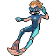

# Route 130 — Trainer Pokémon

## [ Main Area ]

### Trainer Rosters

| Trainer | P1 | P2 | P3 |
|:-------:|:--:|:--:|:--:|
|  Swimmer Katie [149] | 
 [Pelipper](../../pokemon/pelipper.md) Lv. 54
 | 
 [Mantine](../../pokemon/mantine.md) Lv. 55
 |
|  Triathlete Swimmer Karsen [719] | 
 [Azumarill](../../pokemon/azumarill.md) Lv. 56
 |
|  Swimmer Rodney [136] | 
 [Tentacruel](../../pokemon/tentacruel.md) Lv. 54
 | 
 [Carracosta](../../pokemon/carracosta.md) Lv. 54
 | 
 its shell regularly. Immediately after molting, its shell is soft and tender. Until the shell hardens, this Pokémon hides in its streambed burrow to avoid attack from its foes.") [Crawdaunt](../../pokemon/crawdaunt.md) Lv. 54
 |

## [ Underwater ]

### Trainer Rosters

| Trainer | P1 |
|:-------:|:--:|
|  Scuba Diver Silas [742] | 
 [Whiscash](../../pokemon/whiscash.md) Lv. 60
 |
|  Free Diver Cordura [755] | 
 [Corsola](../../pokemon/corsola.md) Lv. 60
 |

