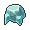
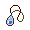

# Route 131 — Special Battles

---

## [ Main Area (Postgame) ]

### Wallace

| Pokémon | Attributes | Item | Moves |
|:-------:|------------|:----:|-------|
|  | **Lv. 77** [Politoed](../../pokemon/politoed.md) **Ability:** Drizzle  |  Damp Rock | 1. Hydro Pump 2. Blizzard 3. Focus Blast 4. Hypnosis |
|  | **Lv. 77** [Ludicolo](../../pokemon/ludicolo.md) **Ability:** Swift Swim   |  Life Orb | 1. Hydro Pump 2. Ice Beam 3. Energy Ball 4. Rain Dance |
|  | **Lv. 77** [Kingdra](../../pokemon/kingdra.md) **Ability:** Swift Swim   |  Mystic Water | 1. Hydro Pump 2. Ice Beam 3. Dragon Pulse 4. Rain Dance |
|  | **Lv. 77** [Gyarados](../../pokemon/gyarados.md) **Ability:** Intimidate   |  Wacan Berry | 1. Dragon Dance 2. Waterfall 3. Earthquake 4. Bounce |
|  | **Lv. 79** [Milotic](../../pokemon/milotic.md) **Ability:** Cute Charm  |  Sitrus Berry | 1. Hydro Pump 2. Ice Beam 3. Recover 4. Hypnosis |
|  | **Lv. 79** [Swampert](../../pokemon/swampert.md) **Ability:** Torrent   |  Swampertite | 1. Waterfall 2. Earthquake 3. Stone Edge 4. Ice Punch |

