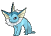
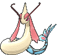

# Route 131 — Trainer Pokémon

## [ Main Area ]

### Trainer Rosters

| Trainer | P1 | P2 | P3 |
|:-------:|:--:|:--:|:--:|
|  Swimmer Kara [151] | 
 [Alomomola](../../pokemon/alomomola.md) Lv. 54
 | 
 [Jellicent](../../pokemon/jellicent.md) Lv. 54
 | 
 [Gorebyss](../../pokemon/gorebyss.md) Lv. 54
 |
|  Swimmer Herman [138] | 
 [Relicanth](../../pokemon/relicanth.md) Lv. 54
 | 
 [Empoleon](../../pokemon/empoleon.md) Lv. 54
 | 
 [Golduck](../../pokemon/golduck.md) Lv. 54
 |
|  Swimmer Susie [150] | 
 [Corsola](../../pokemon/corsola.md) Lv. 54
 | 
 [Vaporeon](../../pokemon/vaporeon.md) Lv. 54
 | 
 [Dewgong](../../pokemon/dewgong.md) Lv. 54
 |
|  Swimmer Richard [137] | 
 [Octillery](../../pokemon/octillery.md) Lv. 54
 | 
 [Barbaracle](../../pokemon/barbaracle.md) Lv. 54
 | 
 [Cloyster](../../pokemon/cloyster.md) Lv. 54
 |
|  Sis & Bro Rell & Ian [544] | 
 [Slowbro](../../pokemon/slowbro.md) Lv. 56
 | 
 [Slowking](../../pokemon/slowking.md) Lv. 57
 |

## [ Main Area (Postgame) ]

### Trainer Rosters

| Trainer | P1 | P2 | P3 | P4 | P5 | P6 |
|:-------:|:--:|:--:|:--:|:--:|:--:|:--:|
|  Sootopolitan Wallace [943] | 
 [Politoed](../../pokemon/politoed.md) Lv. 77
 | 
 [Ludicolo](../../pokemon/ludicolo.md) Lv. 77
 | 
 [Kingdra](../../pokemon/kingdra.md) Lv. 77
 | 
 [Gyarados](../../pokemon/gyarados.md) Lv. 77
 | 
 [Milotic](../../pokemon/milotic.md) Lv. 79
 | 
 [Swampert](../../pokemon/swampert.md) Lv. 79
 |

