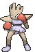

# Route 132 — Trainer Pokémon

## [ Main Area ]

### Trainer Rosters

| Trainer | P1 | P2 | P3 |
|:-------:|:--:|:--:|:--:|
|  Black Belt Kiyo [058] | 
 [Hitmonchan](../../pokemon/hitmonchan.md) Lv. 58
 | 
 [Throh](../../pokemon/throh.md) Lv. 58
 | 
 [Hariyama](../../pokemon/hariyama.md) Lv. 58
 |
|  Fisherman Ronald [502] | 
 [Basculin](../../pokemon/basculin-red-striped.md) Lv. 58
 | 
 [Basculin](../../pokemon/basculin-red-striped.md) Lv. 58
 |
|  Swimmer Gilbert [139] | 
 [Poliwrath](../../pokemon/poliwrath.md) Lv. 59
 |

