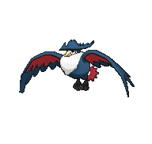

# Route 133 — Trainer Pokémon

### Trainer Rosters

| Trainer | P1 | P2 | P3 | P4 |
|:-------:|:--:|:--:|:--:|:--:|
|  Swimmer Debra [153] | 
 [Corsola](../../pokemon/corsola.md) Lv. 59
 |
|  Swimmer Franklin [140] | 
 [Whiscash](../../pokemon/whiscash.md) Lv. 59
 |
|  Swimmer Linda [154] | 
 [Seaking](../../pokemon/seaking.md) Lv. 59
 |
|  Swimmer Sheryl [152] | 
 [Slowking](../../pokemon/slowking.md) Lv. 59
 |
|  Bird Keeper Beck [506] | 
 [Dodrio](../../pokemon/dodrio.md) Lv. 57
 | 
 [Altaria](../../pokemon/altaria.md) Lv. 57
 | 
 [Honchkrow](../../pokemon/honchkrow.md) Lv. 57
 |
|  Ace Trainer Warren [503] | 
 [Scizor](../../pokemon/scizor.md) Lv. 58
 | 
 [Chandelure](../../pokemon/chandelure.md) Lv. 58
 | 
 [Dusknoir](../../pokemon/dusknoir.md) Lv. 58
 | 
 [Alakazam](../../pokemon/alakazam.md) Lv. 58
 |
|  Backpacker Grayson [724] | 
 [Ditto](../../pokemon/ditto.md) Lv. 59
 |
|  Fisherman River [779] | 
 [Kingdra](../../pokemon/kingdra.md) Lv. 59
 |

