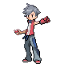
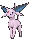
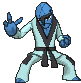

# Route 134 — Trainer Pokémon

---

## [ Main Area ]

### Trainer Rosters

| Trainer | P1 | P2 | P3 | P4 |
|:-------:|:--:|:--:|:--:|:--:|
|  Bird Keeper Alex [504] | 
 [Staraptor](../../pokemon/staraptor.md) Lv. 57
 | 
 [Unfezant](../../pokemon/unfezant.md) Lv. 57
 | 
 [Pidgeot](../../pokemon/pidgeot.md) Lv. 57
 |
|  Swimmer Jack [141] | 
 [Sharpedo](../../pokemon/sharpedo.md) Lv. 59
 |
|  Swimmer Laurel [156] | 
 [Vaporeon](../../pokemon/vaporeon.md) Lv. 59
 |
|  Dragon Tamer Aaron [505] | 
 [Shelgon](../../pokemon/shelgon.md) Lv. 59
 | 
 [Zweilous](../../pokemon/zweilous.md) Lv. 59
 | 
 [Dragonair](../../pokemon/dragonair.md) Lv. 59
 |
|  Ace Trainer Elaine [228] | 
 [Espeon](../../pokemon/espeon.md) Lv. 58
 | 
 [Togekiss](../../pokemon/togekiss.md) Lv. 58
 | 
 [Milotic](../../pokemon/milotic.md) Lv. 58
 | 
 [Serperior](../../pokemon/serperior.md) Lv. 58
 |
|  Black Belt Hitoshi [057] | 
 [Hitmonlee](../../pokemon/hitmonlee.md) Lv. 58
 | 
 [Sawk](../../pokemon/sawk.md) Lv. 58
 | 
 [Breloom](../../pokemon/breloom.md) Lv. 58
 |

