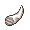
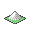

# Rustboro City — Special Battles

---

## [ Gym ]

### Leader Roxanne

| Pokémon | Attributes | Item | Moves |
|:-------:|------------|:----:|-------|
|  | **Lv. 14** [Archen](../../pokemon/archen.md) **Ability:** Defeatist   |  Sharp Beak | 1. Rock Tomb 2. Wing Attack 3. Double Team 4. Quick Attack |
|  | **Lv. 14** [Omanyte](../../pokemon/omanyte.md) **Ability:** Weak Armor   |  Mystic Water | 1. Ancient Power 2. Bubble Beam 3. Icy Wind 4. Tickle |
|  | **Lv. 14** [Tyrunt](../../pokemon/tyrunt.md) **Ability:** Strong Jaw   |  Dragon Fang | 1. Rock Tomb 2. Dragon Pulse 3. Bite 4. Stealth Rock |
|  | **Lv. 14** [Anorith](../../pokemon/anorith.md) **Ability:** Battle Armor   |  Silver Powder | 1. Rock Tomb 2. Bug Bite 3. Aqua Jet 4. Sandstorm |
|  | **Lv. 14** [Lileep](../../pokemon/lileep.md) **Ability:** Storm Drain   |  Miracle Seed | 1. Rock Tomb 2. Bullet Seed 3. Acid 4. Sandstorm |
|  | **Lv. 16** [Nosepass](../../pokemon/nosepass.md) **Ability:** Sand Force  |  Sitrus Berry | 1. Rock Tomb 2. Magnitude 3. Zap Cannon 4. Lock-On |

