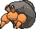
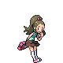

# Rustboro City — Trainer Pokémon

---

## [ Gym ]

### Trainer Rosters

| Trainer | P1 | P2 | P3 | P4 | P5 | P6 |
|:-------:|:--:|:--:|:--:|:--:|:--:|:--:|
|  Youngster Josh [562] | 
 [Roggenrola](../../pokemon/roggenrola.md) Lv. 12
 | 
 [Geodude](../../pokemon/geodude.md) Lv. 12
 | 
 [Cranidos](../../pokemon/cranidos.md) Lv. 12
 |
|  Youngster Tommy [022] | 
 [Dwebble](../../pokemon/dwebble.md) Lv. 12
 | 
 [Shieldon](../../pokemon/shieldon.md) Lv. 12
 | 
 [Amaura](../../pokemon/amaura.md) Lv. 12
 |
|  Schoolkid Georgia [667] | 
 [Bonsly](../../pokemon/bonsly.md) Lv. 12
 | 
 [Kabuto](../../pokemon/kabuto.md) Lv. 12
 | 
 [Tirtouga](../../pokemon/tirtouga.md) Lv. 12
 |
|  Leader Roxanne [561] | 
 [Archen](../../pokemon/archen.md) Lv. 14
 | 
 [Omanyte](../../pokemon/omanyte.md) Lv. 14
 | 
 [Tyrunt](../../pokemon/tyrunt.md) Lv. 14
 | 
 [Anorith](../../pokemon/anorith.md) Lv. 14
 | 
 [Lileep](../../pokemon/lileep.md) Lv. 14
 | 
 [Nosepass](../../pokemon/nosepass.md) Lv. 16
 |

### Special Battles

1. [Leader Roxanne](special_battles.md#leader-roxanne)

---

## [ Main Area (Postgame) ]

### Trainer Rosters

| Trainer | P1 | P2 | P3 |
|:-------:|:--:|:--:|:--:|
|  Team Magma Grunt [892] | 
 [Chandelure](../../pokemon/chandelure.md) Lv. 75
 | 
 [Klinklang](../../pokemon/klinklang.md) Lv. 75
 | 
 [Magmortar](../../pokemon/magmortar.md) Lv. 75
 |
|  Team Magma Grunt [893] | 
 [Steelix](../../pokemon/steelix.md) Lv. 75
 | 
 [Typhlosion](../../pokemon/typhlosion.md) Lv. 75
 | 
 [Absol](../../pokemon/absol.md) Lv. 75
 |
|  Team Magma Grunt [894] | 
 [Houndoom](../../pokemon/houndoom.md) Lv. 75
 | 
 [Mightyena](../../pokemon/mightyena.md) Lv. 75
 | 
 [Swoobat](../../pokemon/swoobat.md) Lv. 75
 |
|  Team Aqua Grunt [895] | 
 [Eelektross](../../pokemon/eelektross.md) Lv. 75
 | 
 [Sunflora](../../pokemon/sunflora.md) Lv. 75
 | 
 [Starmie](../../pokemon/starmie.md) Lv. 75
 |
|  Team Aqua Grunt [896] | 
 [Tangrowth](../../pokemon/tangrowth.md) Lv. 75
 | 
 [Empoleon](../../pokemon/empoleon.md) Lv. 75
 | 
 [Absol](../../pokemon/absol.md) Lv. 75
 |
|  Team Aqua Grunt [897] | 
 [Tentacruel](../../pokemon/tentacruel.md) Lv. 75
 | 
 [Liepard](../../pokemon/liepard.md) Lv. 75
 | 
 [Swoobat](../../pokemon/swoobat.md) Lv. 75
 |

