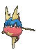
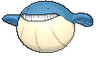

# Rusturf Tunnel — Trainer Pokémon

## [ Main Area ]

### Trainer Rosters

| Trainer | P1 | P2 | P3 |
|:-------:|:--:|:--:|:--:|
|  Team Aqua Grunt [254] | 
 [Poochyena](../../pokemon/poochyena.md) Lv. 14
 | 
 [Carvanha](../../pokemon/carvanha.md) Lv. 14
 | 
 [Wailmer](../../pokemon/wailmer.md) Lv. 14
 |
|  Team Magma Grunt [255] | 
 [Poochyena](../../pokemon/poochyena.md) Lv. 14
 | 
 [Numel](../../pokemon/numel.md) Lv. 14
 | 
 [Slugma](../../pokemon/slugma.md) Lv. 14
 |
|  Hiker Mike [307] | 
 [Dwebble](../../pokemon/dwebble.md) Lv. 22
 | 
 [Drilbur](../../pokemon/drilbur.md) Lv. 22
 | 
 [Larvitar](../../pokemon/larvitar.md) Lv. 22
 |

