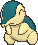

# Rusturf Tunnel — Wild Pokémon

### Cave

| Sprite | Pokémon | Encounter | Chance |
|:------:|---------|:---------:|--------|
|  | [Paras](../../pokemon/paras.md/) Lv. 10 |  Cave | 10% |
|  | [Machop](../../pokemon/machop.md/) Lv. 10 |  Cave | 10% |
|  | [Gastly](../../pokemon/gastly.md/) Lv. 10 |  Cave | 10% |
|  | [Spinarak](../../pokemon/spinarak.md/) Lv. 10 |  Cave | 10% |
|  | [Teddiursa](../../pokemon/teddiursa.md/) Lv. 10 |  Cave | 10% |
|  | [Nincada](../../pokemon/nincada.md/) Lv. 10 |  Cave | 10% |
|  | [Whismur](../../pokemon/whismur.md/) Lv. 10 |  Cave | 10% |
|  | [Drilbur](../../pokemon/drilbur.md/) Lv. 10 |  Cave | 10% |
|  | [Timburr](../../pokemon/timburr.md/) Lv. 10 |  Cave | 10% |
|  | [Joltik](../../pokemon/joltik.md/) Lv. 10 |  Cave | 10% |

### Rock Smash

| Sprite | Pokémon | Encounter | Chance |
|:------:|---------|:---------:|--------|
|  | [Geodude](../../pokemon/geodude.md/) Lv. 20 |  Rock Smash | 50% |
|  | [Dwebble](../../pokemon/dwebble.md/) Lv. 20 |  Rock Smash | 50% |

### Horde

| Sprite | Pokémon | Encounter | Chance |
|:------:|---------|:---------:|--------|
|  | [Cyndaquil](../../pokemon/cyndaquil.md/) Lv. 10 |  Horde | 50% |
|  | [Chimchar](../../pokemon/chimchar.md/) Lv. 10 |  Horde | 50% |

