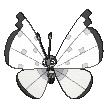
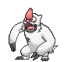
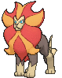
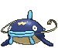
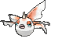

# Safari Zone — Wild Pokémon

## [ 1 ]

### Grass

| Sprite | Pokémon | Encounter Type | Level | Chance |
|:------:|---------|:--------------:|-------|--------|
|  | [Butterfree](../../pokemon/butterfree.md/) |  Grass | 45 | 16% |
|  | [Beedrill](../../pokemon/beedrill.md/) |  Grass | 45 | 16% |
|  | [Ledian](../../pokemon/ledian.md/) |  Grass | 45 | 16% |
|  | [Ariados](../../pokemon/ariados.md/) |  Grass | 45 | 16% |
|  | [Kricketune](../../pokemon/kricketune.md/) |  Grass | 45 | 16% |
|  | [Wormadam](../../pokemon/wormadam-plant.md/) |  Grass | 45 | 16% |

### Tall Grass

| Sprite | Pokémon | Encounter Type | Level | Chance |
|:------:|---------|:--------------:|-------|--------|
|  | [Beautifly](../../pokemon/beautifly.md/) |  Tall Grass | 45 | 16% |
|  | [Dustox](../../pokemon/dustox.md/) |  Tall Grass | 45 | 16% |
|  | [Mothim](../../pokemon/mothim.md/) |  Tall Grass | 45 | 16% |
|  | [Swadloon](../../pokemon/swadloon.md/) |  Tall Grass | 45 | 16% |
|  | [Whirlipede](../../pokemon/whirlipede.md/) |  Tall Grass | 45 | 16% |
|  | [Vivillon](../../pokemon/vivillon.md/) |  Tall Grass | 45 | 16% |

### DexNav

| Sprite | Pokémon | Encounter Type | Level | Chance |
|:------:|---------|:--------------:|-------|--------|
|  | [Leavanny](../../pokemon/leavanny.md/) |  DexNav | 50 | 100% |

### Horde

| Sprite | Pokémon | Encounter Type | Level | Chance |
|:------:|---------|:--------------:|-------|--------|
|  | [Vivillon](../../pokemon/vivillon.md/) |  Horde | 25 | 100% |

### Surfing

| Sprite | Pokémon | Encounter Type | Level | Chance |
|:------:|---------|:--------------:|-------|--------|
|  | [Masquerain](../../pokemon/masquerain.md/) |  Surfing | 40 - 45 | 100% |

### Old Rod

| Sprite | Pokémon | Encounter Type | Level | Chance |
|:------:|---------|:--------------:|-------|--------|
|  | [Qwilfish](../../pokemon/qwilfish.md/) |  Old Rod | 15 | 100% |

### Good Rod

| Sprite | Pokémon | Encounter Type | Level | Chance |
|:------:|---------|:--------------:|-------|--------|
|  | [Qwilfish](../../pokemon/qwilfish.md/) |  Good Rod | 35 | 100% |

### Super Rod

| Sprite | Pokémon | Encounter Type | Level | Chance |
|:------:|---------|:--------------:|-------|--------|
|  | [Qwilfish](../../pokemon/qwilfish.md/) |  Super Rod | 55 | 100% |

## [ 2 ]

### Grass

| Sprite | Pokémon | Encounter Type | Level | Chance |
|:------:|---------|:--------------:|-------|--------|
|  | [Pidgeotto](../../pokemon/pidgeotto.md/) |  Grass | 45 | 20% |
|  | [Noctowl](../../pokemon/noctowl.md/) |  Grass | 45 | 20% |
|  | [Staravia](../../pokemon/staravia.md/) |  Grass | 45 | 20% |
|  | [Tranquill](../../pokemon/tranquill.md/) |  Grass | 45 | 20% |
|  | [Fletchinder](../../pokemon/fletchinder.md/) |  Grass | 45 | 20% |

### Tall Grass

| Sprite | Pokémon | Encounter Type | Level | Chance |
|:------:|---------|:--------------:|-------|--------|
|  | [Raticate](../../pokemon/raticate.md/) |  Tall Grass | 45 | 20% |
|  | [Furret](../../pokemon/furret.md/) |  Tall Grass | 45 | 20% |
|  | [Vigoroth](../../pokemon/vigoroth.md/) |  Tall Grass | 45 | 20% |
|  | [Bibarel](../../pokemon/bibarel.md/) |  Tall Grass | 45 | 20% |
|  | [Watchog](../../pokemon/watchog.md/) |  Tall Grass | 45 | 20% |

### DexNav

| Sprite | Pokémon | Encounter Type | Level | Chance |
|:------:|---------|:--------------:|-------|--------|
|  | [Pidgeot](../../pokemon/pidgeot.md/) |  DexNav | 50 | 100% |

### Horde

| Sprite | Pokémon | Encounter Type | Level | Chance |
|:------:|---------|:--------------:|-------|--------|
|  | [Fletchinder](../../pokemon/fletchinder.md/) |  Horde | 30 | 100% |

### Surfing

| Sprite | Pokémon | Encounter Type | Level | Chance |
|:------:|---------|:--------------:|-------|--------|
|  | [Swanna](../../pokemon/swanna.md/) |  Surfing | 40 - 45 | 100% |

### Old Rod

| Sprite | Pokémon | Encounter Type | Level | Chance |
|:------:|---------|:--------------:|-------|--------|
|  | [Finneon](../../pokemon/finneon.md/) |  Old Rod | 15 | 100% |

### Good Rod

| Sprite | Pokémon | Encounter Type | Level | Chance |
|:------:|---------|:--------------:|-------|--------|
|  | [Finneon](../../pokemon/finneon.md/) |  Good Rod | 35 | 100% |

### Super Rod

| Sprite | Pokémon | Encounter Type | Level | Chance |
|:------:|---------|:--------------:|-------|--------|
|  | [Lumineon](../../pokemon/lumineon.md/) |  Super Rod | 55 | 100% |

## [ 3 ]

### Grass

| Sprite | Pokémon | Encounter Type | Level | Chance |
|:------:|---------|:--------------:|-------|--------|
|  | [Nidorina](../../pokemon/nidorina.md/) |  Grass | 45 | 20% |
|  | [Nidorino](../../pokemon/nidorino.md/) |  Grass | 45 | 20% |
|  | [Swalot](../../pokemon/swalot.md/) |  Grass | 45 | 20% |
|  | [Toxicroak](../../pokemon/toxicroak.md/) |  Grass | 45 | 20% |
|  | [Palpitoad](../../pokemon/palpitoad.md/) |  Grass | 45 | 20% |

### Tall Grass

| Sprite | Pokémon | Encounter Type | Level | Chance |
|:------:|---------|:--------------:|-------|--------|
|  | [Magmar](../../pokemon/magmar.md/) |  Tall Grass | 45 | 20% |
|  | [Houndoom](../../pokemon/houndoom.md/) |  Tall Grass | 45 | 20% |
|  | [Camerupt](../../pokemon/camerupt.md/) |  Tall Grass | 45 | 20% |
|  | [Darmanitan](../../pokemon/darmanitan-standard.md/) |  Tall Grass | 45 | 20% |
|  | [Pyroar](../../pokemon/pyroar.md/) |  Tall Grass | 45 | 20% |

### DexNav

| Sprite | Pokémon | Encounter Type | Level | Chance |
|:------:|---------|:--------------:|-------|--------|
|  | [Seismitoad](../../pokemon/seismitoad.md/) |  DexNav | 50 | 100% |

### Horde

| Sprite | Pokémon | Encounter Type | Level | Chance |
|:------:|---------|:--------------:|-------|--------|
|  | [Houndour](../../pokemon/houndour.md/) |  Horde | 30 | 100% |

### Surfing

| Sprite | Pokémon | Encounter Type | Level | Chance |
|:------:|---------|:--------------:|-------|--------|
|  | [Gastrodon](../../pokemon/gastrodon.md/) |  Surfing | 40 - 45 | 100% |

### Old Rod

| Sprite | Pokémon | Encounter Type | Level | Chance |
|:------:|---------|:--------------:|-------|--------|
|  | [Barboach](../../pokemon/barboach.md/) |  Old Rod | 15 | 100% |

### Good Rod

| Sprite | Pokémon | Encounter Type | Level | Chance |
|:------:|---------|:--------------:|-------|--------|
|  | [Barboach](../../pokemon/barboach.md/) |  Good Rod | 35 | 100% |

### Super Rod

| Sprite | Pokémon | Encounter Type | Level | Chance |
|:------:|---------|:--------------:|-------|--------|
|  | [Whiscash](../../pokemon/whiscash.md/) |  Super Rod | 55 | 100% |

## [ 4 ]

### Grass

| Sprite | Pokémon | Encounter Type | Level | Chance |
|:------:|---------|:--------------:|-------|--------|
|  | [Sudowoodo](../../pokemon/sudowoodo.md/) |  Grass | 45 | 20% |
|  | [Lombre](../../pokemon/lombre.md/) |  Grass | 45 | 20% |
|  | [Nuzleaf](../../pokemon/nuzleaf.md/) |  Grass | 45 | 20% |
|  | [Breloom](../../pokemon/breloom.md/) |  Grass | 45 | 20% |
|  | [Gogoat](../../pokemon/gogoat.md/) |  Grass | 45 | 20% |

### Tall Grass

| Sprite | Pokémon | Encounter Type | Level | Chance |
|:------:|---------|:--------------:|-------|--------|
|  | [Mr. Mime](../../pokemon/mr-mime.md/) |  Tall Grass | 45 | 20% |
|  | [Wobbuffet](../../pokemon/wobbuffet.md/) |  Tall Grass | 45 | 20% |
|  | [Grumpig](../../pokemon/grumpig.md/) |  Tall Grass | 45 | 20% |
|  | [Meowstic](../../pokemon/meowstic-male.md/) |  Tall Grass | 45 | 20% |
|  | [Doublade](../../pokemon/doublade.md/) |  Tall Grass | 45 | 20% |

### DexNav

| Sprite | Pokémon | Encounter Type | Level | Chance |
|:------:|---------|:--------------:|-------|--------|
|  | [Shiftry](../../pokemon/shiftry.md/) |  DexNav | 50 | 100% |

### Horde

| Sprite | Pokémon | Encounter Type | Level | Chance |
|:------:|---------|:--------------:|-------|--------|
|  | [Wynaut](../../pokemon/wynaut.md/) |  Horde | 30 | 100% |

### Surfing

| Sprite | Pokémon | Encounter Type | Level | Chance |
|:------:|---------|:--------------:|-------|--------|
|  | [Quagsire](../../pokemon/quagsire.md/) |  Surfing | 40 - 45 | 100% |

### Old Rod

| Sprite | Pokémon | Encounter Type | Level | Chance |
|:------:|---------|:--------------:|-------|--------|
|  | [Goldeen](../../pokemon/goldeen.md/) |  Old Rod | 15 | 100% |

### Good Rod

| Sprite | Pokémon | Encounter Type | Level | Chance |
|:------:|---------|:--------------:|-------|--------|
|  | [Goldeen](../../pokemon/goldeen.md/) |  Good Rod | 35 | 100% |

### Super Rod

| Sprite | Pokémon | Encounter Type | Level | Chance |
|:------:|---------|:--------------:|-------|--------|
|  | [Seaking](../../pokemon/seaking.md/) |  Super Rod | 55 | 100% |

