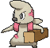
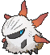

# Scorched Slab — Wild Pokémon

---

## [ Main Area ]

### Cave

| Sprite | Pokémon | Encounter | Chance |
|:------:|---------|:---------:|--------|
|  | [Zubat](../../pokemon/zubat.md/) Lv. 35 |  Cave | 10% |
|  | [Onix](../../pokemon/onix.md/) Lv. 35 |  Cave | 10% |
|  | [Rhyhorn](../../pokemon/rhyhorn.md/) Lv. 35 |  Cave | 10% |
|  | [Aron](../../pokemon/aron.md/) Lv. 35 |  Cave | 10% |
|  | [Woobat](../../pokemon/woobat.md/) Lv. 35 |  Cave | 10% |
|  | [Drilbur](../../pokemon/drilbur.md/) Lv. 35 |  Cave | 10% |
|  | [Timburr](../../pokemon/timburr.md/) Lv. 35 |  Cave | 10% |
|  | [Axew](../../pokemon/axew.md/) Lv. 35 |  Cave | 10% |
|  | [Larvesta](../../pokemon/larvesta.md/) Lv. 35 |  Cave | 10% |
|  | [Noibat](../../pokemon/noibat.md/) Lv. 35 |  Cave | 10% |

### Horde

| Sprite | Pokémon | Encounter | Chance |
|:------:|---------|:---------:|--------|
|  | [Zubat](../../pokemon/zubat.md/) Lv. 25 |  Horde | 100% |

### Surfing

| Sprite | Pokémon | Encounter | Chance |
|:------:|---------|:---------:|--------|
|  | [Zubat](../../pokemon/zubat.md/) Lv. 30 - 40 |  Surfing | 50% |
|  | [Golbat](../../pokemon/golbat.md/) Lv. 30 - 40 |  Surfing | 50% |

### Old Rod

| Sprite | Pokémon | Encounter | Chance |
|:------:|---------|:---------:|--------|
|  | [Poliwag](../../pokemon/poliwag.md/) Lv. 15 |  Old Rod | 100% |

### Good Rod

| Sprite | Pokémon | Encounter | Chance |
|:------:|---------|:---------:|--------|
|  | [Poliwag](../../pokemon/poliwag.md/) Lv. 35 |  Good Rod | 100% |

### Super Rod

| Sprite | Pokémon | Encounter | Chance |
|:------:|---------|:---------:|--------|
|  | [Poliwhirl](../../pokemon/poliwhirl.md/) Lv. 55 |  Super Rod | 100% |

---

## [ Basement ]

### Cave

| Sprite | Pokémon | Encounter | Chance |
|:------:|---------|:---------:|--------|
|  | [Golbat](../../pokemon/golbat.md/) Lv. 40 |  Cave | 10% |
|  | [Rhydon](../../pokemon/rhydon.md/) Lv. 40 |  Cave | 10% |
|  | [Steelix](../../pokemon/steelix.md/) Lv. 40 |  Cave | 10% |
|  | [Lairon](../../pokemon/lairon.md/) Lv. 40 |  Cave | 10% |
|  | [Swoobat](../../pokemon/swoobat.md/) Lv. 40 |  Cave | 10% |
|  | [Excadrill](../../pokemon/excadrill.md/) Lv. 40 |  Cave | 10% |
|  | [Gurdurr](../../pokemon/gurdurr.md/) Lv. 40 |  Cave | 10% |
|  | [Fraxure](../../pokemon/fraxure.md/) Lv. 40 |  Cave | 10% |
|  | [Volcarona](../../pokemon/volcarona.md/) Lv. 40 |  Cave | 10% |
|  | [Noivern](../../pokemon/noivern.md/) Lv. 40 |  Cave | 10% |

### Horde

| Sprite | Pokémon | Encounter | Chance |
|:------:|---------|:---------:|--------|
|  | [Golbat](../../pokemon/golbat.md/) Lv. 25 |  Horde | 100% |

### Surfing

| Sprite | Pokémon | Encounter | Chance |
|:------:|---------|:---------:|--------|
|  | [Buizel](../../pokemon/buizel.md/) Lv. 35 - 45 |  Surfing | 50% |
|  | [Floatzel](../../pokemon/floatzel.md/) Lv. 35 - 45 |  Surfing | 50% |

### Old Rod

| Sprite | Pokémon | Encounter | Chance |
|:------:|---------|:---------:|--------|
|  | [Barboach](../../pokemon/barboach.md/) Lv. 15 |  Old Rod | 100% |

### Good Rod

| Sprite | Pokémon | Encounter | Chance |
|:------:|---------|:---------:|--------|
|  | [Barboach](../../pokemon/barboach.md/) Lv. 35 |  Good Rod | 100% |

### Super Rod

| Sprite | Pokémon | Encounter | Chance |
|:------:|---------|:---------:|--------|
|  | [Whiscash](../../pokemon/whiscash.md/) Lv. 55 |  Super Rod | 100% |

