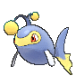
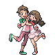
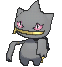
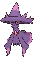

# Sea Mauville — Trainer Pokémon

---

## [ Outside ]

### Trainer Rosters

| Trainer | P1 |
|:-------:|:--:|
|  Sailor Duncan [363] | 
 [Barbaracle](../../pokemon/barbaracle.md) Lv. 38
 |
|  Tuber Charlie [362] | 
 [Lanturn](../../pokemon/lanturn.md) Lv. 38
 |

---

## [ Inside ]

### Trainer Rosters

| Trainer | P1 | P2 |
|:-------:|:--:|:--:|
|  Young Couple Lois & Hal [364] | 
 [Leavanny](../../pokemon/leavanny.md) Lv. 38
 | 
 [Scolipede](../../pokemon/scolipede.md) Lv. 38
 |
|  Mysterious Sisters Scall & Ion [780] | 
 [Banette](../../pokemon/banette.md) Lv. 60
 | 
 [Mr. Mime](../../pokemon/mr-mime.md) Lv. 59
 |

### Rematches

| Trainer | P1 | P2 | P3 | P4 |
|:-------:|:--:|:--:|:--:|:--:|
| ") Young Couple Lois & Hal (6) [465] | 
 [Leavanny](../../pokemon/leavanny.md) Lv. 47
 | 
 [Scolipede](../../pokemon/scolipede.md) Lv. 47
 |
| ") Young Couple Lois & Hal (7) [466] | 
 [Leavanny](../../pokemon/leavanny.md) Lv. 59
 | 
 [Scolipede](../../pokemon/scolipede.md) Lv. 59
 | 
 [Vileplume](../../pokemon/vileplume.md) Lv. 59
 | 
 [Victreebel](../../pokemon/victreebel.md) Lv. 59
 |
| ") Young Couple Lois & Hal (8) [467] | 
 [Leavanny](../../pokemon/leavanny.md) Lv. 64
 | 
 [Scolipede](../../pokemon/scolipede.md) Lv. 64
 | 
 [Vileplume](../../pokemon/vileplume.md) Lv. 64
 | 
 [Victreebel](../../pokemon/victreebel.md) Lv. 64
 |
| ") Young Couple Lois & Hal (C) [498] | 
 [Leavanny](../../pokemon/leavanny.md) Lv. 75
 | 
 [Scolipede](../../pokemon/scolipede.md) Lv. 75
 | 
 [Vileplume](../../pokemon/vileplume.md) Lv. 75
 | 
 [Victreebel](../../pokemon/victreebel.md) Lv. 75
 |
| ") Mysterious Sisters Scall & Ion (7) [783] | 
 [Banette](../../pokemon/banette.md) Lv. 61
 | 
 [Mr. Mime](../../pokemon/mr-mime.md) Lv. 60
 |
| ") Mysterious Sisters Scall & Ion (8) [784] | 
 [Banette](../../pokemon/banette.md) Lv. 66
 | 
 [Mr. Mime](../../pokemon/mr-mime.md) Lv. 65
 | 
 [Mismagius](../../pokemon/mismagius.md) Lv. 66
 | 
 [Mawile](../../pokemon/mawile.md) Lv. 65
 |
| ") Mysterious Sisters Scall & Ion (C) [785] | 
 [Banette](../../pokemon/banette.md) Lv. 76
 | 
 [Mr. Mime](../../pokemon/mr-mime.md) Lv. 75
 | 
 [Mismagius](../../pokemon/mismagius.md) Lv. 76
 | 
 [Mawile](../../pokemon/mawile.md) Lv. 75
 |

