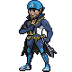

# Seafloor Cavern — Special Battles

---

## [ Back Rooms ]

### Maxie

| Pokémon | Attributes | Item | Moves |
|:-------:|------------|:----:|-------|
|  | **Lv. 63** [Crobat](../../pokemon/crobat.md) **Ability:** Infiltrator   | Heat Rock | 1. Brave Bird 2. U-turn 3. Hypnosis 4. Sunny Day |
|  | **Lv. 63** [Houndoom](../../pokemon/houndoom.md) **Ability:** Flash Fire   | White Herb | 1. Overheat 2. Dark Pulse 3. Sludge Bomb 4. Solar Beam |
|  | **Lv. 63** [Claydol](../../pokemon/claydol.md) **Ability:** Levitate   | Leftovers | 1. Trick Room 2. Earthquake 3. Psychic 4. Ice Beam |
|  | **Lv. 63** [Tyranitar](../../pokemon/tyranitar.md) **Ability:** Sand Stream   | Assault Vest | 1. Stone Edge 2. Crunch 3. Iron Tail 4. Blizzard |
|  | **Lv. 63** [Chandelure](../../pokemon/chandelure.md) **Ability:** Flame Body   | Focus Sash | 1. Trick Room 2. Fire Blast 3. Shadow Ball 4. Energy Ball |
|  | **Lv. 65** [Camerupt](../../pokemon/camerupt.md) **Ability:** Solid Rock   | Cameruptite | 1. Fire Blast 2. Earth Power 3. Flash Cannon 4. Rock Slide |

### Archie

| Pokémon | Attributes | Item | Moves |
|:-------:|------------|:----:|-------|
|  | **Lv. 63** [Crobat](../../pokemon/crobat.md) **Ability:** Infiltrator   | Damp Rock | 1. Brave Bird 2. U-turn 3. Hypnosis 4. Rain Dance |
|  | **Lv. 63** [Tentacruel](../../pokemon/tentacruel.md) **Ability:** Rain Dish   | Black Sludge | 1. Rain Dance 2. Hydro Pump 3. Sludge Wave 4. Ice Beam |
|  | **Lv. 63** [Walrein](../../pokemon/walrein.md) **Ability:** Thick Fat   | Leftovers | 1. Toxic 2. Protect 3. Surf 4. Frost Breath |
|  | **Lv. 63** [Dragonite](../../pokemon/dragonite.md) **Ability:** Multiscale   | Assault Vest | 1. Outrage 2. Extreme Speed 3. Earthquake 4. Fire Blast |
|  | **Lv. 63** [Eelektross](../../pokemon/eelektross.md) **Ability:** Levitate  | Quick Claw | 1. Thunder 2. Knock Off 3. Aqua Tail 4. Thunder Wave |
|  | **Lv. 65** [Sharpedo](../../pokemon/sharpedo.md) **Ability:** Speed Boost   | Sharpedonite | 1. Protect 2. Crunch 3. Hydro Pump 4. Ice Fang |

