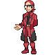

## [ Front Rooms ]

### Trainer Rosters

| Trainer | P1 | P2 |
|:-------:|:--:|:--:|
|  Team Magma Grunt [242] | 
 [Golem](../../pokemon/golem.md) Lv. 60
 | 
 [Magcargo](../../pokemon/magcargo.md) Lv. 60
 |
|  Team Magma Grunt [243] | 
 [Steelix](../../pokemon/steelix.md) Lv. 60
 | 
 [Weezing](../../pokemon/weezing.md) Lv. 60
 |
|  Team Magma Grunt [858] | 
 [Pyroar](../../pokemon/pyroar.md) Lv. 60
 | 
 [Zangoose](../../pokemon/zangoose.md) Lv. 60
 |
|  Team Magma Grunt [244] | 
 [Nidoking](../../pokemon/nidoking.md) Lv. 60
 | 
 [Darmanitan](../../pokemon/darmanitan-standard.md) Lv. 60
 |
|  Team Magma Grunt [862] | 
 [Gigalith](../../pokemon/gigalith.md) Lv. 60
 | 
 [Rapidash](../../pokemon/rapidash.md) Lv. 60
 |
|  Team Aqua Grunt [185] | 
 [Vileplume](../../pokemon/vileplume.md) Lv. 60
 | 
 [Lumineon](../../pokemon/lumineon.md) Lv. 60
 |
|  Team Aqua Grunt [186] | 
 [Tangrowth](../../pokemon/tangrowth.md) Lv. 60
 | 
 [Muk](../../pokemon/muk.md) Lv. 60
 |
|  Team Aqua Grunt [860] | 
 [Barbaracle](../../pokemon/barbaracle.md) Lv. 60
 | 
 [Seviper](../../pokemon/seviper.md) Lv. 60
 |
|  Team Aqua Grunt [187] | 
 [Nidoqueen](../../pokemon/nidoqueen.md) Lv. 60
 | 
 [Jellicent](../../pokemon/jellicent.md) Lv. 60
 |
|  Team Aqua Grunt [353] | 
 [Roserade](../../pokemon/roserade.md) Lv. 60
 | 
 [Golduck](../../pokemon/golduck.md) Lv. 60
 |

## [ Back Rooms ]

### Trainer Rosters

| Trainer | P1 | P2 | P3 | P4 | P5 | P6 |
|:-------:|:--:|:--:|:--:|:--:|:--:|:--:|
|  Magma Leader Maxie [235] | 
 [Crobat](../../pokemon/crobat.md) Lv. 63
 | 
 [Houndoom](../../pokemon/houndoom.md) Lv. 63
 | 
 [Claydol](../../pokemon/claydol.md) Lv. 63
 | 
 [Tyranitar](../../pokemon/tyranitar.md) Lv. 63
 | 
 [Chandelure](../../pokemon/chandelure.md) Lv. 63
 | 
 [Camerupt](../../pokemon/camerupt.md) Lv. 65
 |
|  Aqua Leader Archie [178] | 
 [Crobat](../../pokemon/crobat.md) Lv. 63
 | 
 [Tentacruel](../../pokemon/tentacruel.md) Lv. 63
 | 
 [Walrein](../../pokemon/walrein.md) Lv. 63
 | 
 [Dragonite](../../pokemon/dragonite.md) Lv. 63
 | 
 [Eelektross](../../pokemon/eelektross.md) Lv. 63
 | 
 [Sharpedo](../../pokemon/sharpedo.md) Lv. 65
 |

