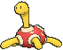
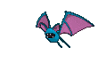
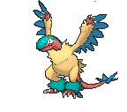

# Seafloor Cavern — Wild Pokémon

## [ Outside ]

### Surfing

| Sprite | Pokémon | Encounter Type | Level | Chance |
|:------:|---------|:--------------:|-------|--------|
|  | [Golbat](../../pokemon/golbat.md/) |  Surfing | 45 - 55 | 100% |

### Old Rod

| Sprite | Pokémon | Encounter Type | Level | Chance |
|:------:|---------|:--------------:|-------|--------|
|  | [Relicanth](../../pokemon/relicanth.md/) |  Old Rod | 15 | 100% |

### Good Rod

| Sprite | Pokémon | Encounter Type | Level | Chance |
|:------:|---------|:--------------:|-------|--------|
|  | [Relicanth](../../pokemon/relicanth.md/) |  Good Rod | 35 | 100% |

### Super Rod

| Sprite | Pokémon | Encounter Type | Level | Chance |
|:------:|---------|:--------------:|-------|--------|
|  | [Relicanth](../../pokemon/relicanth.md/) |  Super Rod | 55 | 100% |

## [ Front Rooms ]

### Cave

| Sprite | Pokémon | Encounter Type | Level | Chance |
|:------:|---------|:--------------:|-------|--------|
|  | [Omanyte](../../pokemon/omanyte.md/) |  Cave | 44 | 10% |
|  | [Kabuto](../../pokemon/kabuto.md/) |  Cave | 44 | 10% |
|  | [Anorith](../../pokemon/anorith.md/) |  Cave | 44 | 10% |
|  | [Lileep](../../pokemon/lileep.md/) |  Cave | 44 | 10% |
|  | [Cranidos](../../pokemon/cranidos.md/) |  Cave | 44 | 10% |
|  | [Shieldon](../../pokemon/shieldon.md/) |  Cave | 44 | 10% |
|  | [Tirtouga](../../pokemon/tirtouga.md/) |  Cave | 44 | 10% |
|  | [Archen](../../pokemon/archen.md/) |  Cave | 44 | 10% |
|  | [Tyrunt](../../pokemon/tyrunt.md/) |  Cave | 44 | 10% |
|  | [Amaura](../../pokemon/amaura.md/) |  Cave | 44 | 10% |

### Rock Smash

| Sprite | Pokémon | Encounter Type | Level | Chance |
|:------:|---------|:--------------:|-------|--------|
|  | [Shuckle](../../pokemon/shuckle.md/) |  Rock Smash | 44 | 100% |

### Horde

| Sprite | Pokémon | Encounter Type | Level | Chance |
|:------:|---------|:--------------:|-------|--------|
|  | [Zubat](../../pokemon/zubat.md/) |  Horde | 30 | 100% |

## [ Water Rooms ]

### Cave

| Sprite | Pokémon | Encounter Type | Level | Chance |
|:------:|---------|:--------------:|-------|--------|
|  | [Golbat](../../pokemon/golbat.md/) |  Cave | 56 | 16% |
|  | [Aerodactyl](../../pokemon/aerodactyl.md/) |  Cave | 56 | 16% |
|  | [Swoobat](../../pokemon/swoobat.md/) |  Cave | 56 | 16% |
|  | [Crustle](../../pokemon/crustle.md/) |  Cave | 56 | 16% |
|  | [Eelektrik](../../pokemon/eelektrik.md/) |  Cave | 56 | 16% |
|  | [Noivern](../../pokemon/noivern.md/) |  Cave | 56 | 16% |

### Horde

| Sprite | Pokémon | Encounter Type | Level | Chance |
|:------:|---------|:--------------:|-------|--------|
|  | [Golbat](../../pokemon/golbat.md/) |  Horde | 35 | 100% |

### Surfing

| Sprite | Pokémon | Encounter Type | Level | Chance |
|:------:|---------|:--------------:|-------|--------|
|  | [Tentacruel](../../pokemon/tentacruel.md/) |  Surfing | 45 - 55 | 50% |
|  | [Jellicent](../../pokemon/jellicent.md/) |  Surfing | 45 - 55 | 50% |

### Old Rod

| Sprite | Pokémon | Encounter Type | Level | Chance |
|:------:|---------|:--------------:|-------|--------|
|  | [Relicanth](../../pokemon/relicanth.md/) |  Old Rod | 15 | 100% |

### Good Rod

| Sprite | Pokémon | Encounter Type | Level | Chance |
|:------:|---------|:--------------:|-------|--------|
|  | [Relicanth](../../pokemon/relicanth.md/) |  Good Rod | 35 | 100% |

### Super Rod

| Sprite | Pokémon | Encounter Type | Level | Chance |
|:------:|---------|:--------------:|-------|--------|
|  | [Relicanth](../../pokemon/relicanth.md/) |  Super Rod | 55 | 100% |

## [ Back Rooms ]

### Cave

| Sprite | Pokémon | Encounter Type | Level | Chance |
|:------:|---------|:--------------:|-------|--------|
|  | [Omastar](../../pokemon/omastar.md/) |  Cave | 56 | 10% |
|  | [Kabutops](../../pokemon/kabutops.md/) |  Cave | 56 | 10% |
|  | [Armaldo](../../pokemon/armaldo.md/) |  Cave | 56 | 10% |
|  | [Cradily](../../pokemon/cradily.md/) |  Cave | 56 | 10% |
|  | [Rampardos](../../pokemon/rampardos.md/) |  Cave | 56 | 10% |
|  | [Bastiodon](../../pokemon/bastiodon.md/) |  Cave | 56 | 10% |
|  | [Carracosta](../../pokemon/carracosta.md/) |  Cave | 56 | 10% |
|  | [Archeops](../../pokemon/archeops.md/) |  Cave | 56 | 10% |
|  | [Tyrantrum](../../pokemon/tyrantrum.md/) |  Cave | 56 | 10% |
|  | [Aurorus](../../pokemon/aurorus.md/) |  Cave | 56 | 10% |

### Rock Smash

| Sprite | Pokémon | Encounter Type | Level | Chance |
|:------:|---------|:--------------:|-------|--------|
|  | [Shuckle](../../pokemon/shuckle.md/) |  Rock Smash | 56 | 100% |

### Horde

| Sprite | Pokémon | Encounter Type | Level | Chance |
|:------:|---------|:--------------:|-------|--------|
|  | [Golbat](../../pokemon/golbat.md/) |  Horde | 35 | 100% |

