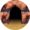
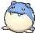

# Shoal Cave — Wild Pokémon

## [ 1F ]

### Cave

| Sprite | Pokémon | Encounter Type | Chance |
|:------:|---------|:--------------:|--------|
|  | [Sneasel](../../pokemon/sneasel.md/) Lv. 40 |  Cave | 10% |
|  | [Swinub](../../pokemon/swinub.md/) Lv. 40 |  Cave | 10% |
|  | [Delibird](../../pokemon/delibird.md/) Lv. 40 |  Cave | 10% |
|  | [Smoochum](../../pokemon/smoochum.md/) Lv. 40 |  Cave | 10% |
|  | [Snorunt](../../pokemon/snorunt.md/) Lv. 40 |  Cave | 10% |
|  | [Spheal](../../pokemon/spheal.md/) Lv. 40 |  Cave | 10% |
|  | [Snover](../../pokemon/snover.md/) Lv. 40 |  Cave | 10% |
|  | [Vanillite](../../pokemon/vanillite.md/) Lv. 40 |  Cave | 10% |
|  | [Cubchoo](../../pokemon/cubchoo.md/) Lv. 40 |  Cave | 10% |
|  | [Bergmite](../../pokemon/bergmite.md/) Lv. 40 |  Cave | 10% |

### DexNav

| Sprite | Pokémon | Encounter Type | Chance |
|:------:|---------|:--------------:|--------|
|  | [Weavile](../../pokemon/weavile.md/) Lv. 50 |  DexNav | 100% |

### Horde

| Sprite | Pokémon | Encounter Type | Chance |
|:------:|---------|:--------------:|--------|
|  | [Bergmite](../../pokemon/bergmite.md/) Lv. 25 |  Horde | 100% |

### Surfing

| Sprite | Pokémon | Encounter Type | Chance |
|:------:|---------|:--------------:|--------|
|  | [Seel](../../pokemon/seel.md/) Lv. 40 - 50 |  Surfing | 50% |
|  | [Dewgong](../../pokemon/dewgong.md/) Lv. 40 - 50 |  Surfing | 50% |

### Old Rod

| Sprite | Pokémon | Encounter Type | Chance |
|:------:|---------|:--------------:|--------|
|  | [Shellder](../../pokemon/shellder.md/) Lv. 15 |  Old Rod | 100% |

### Good Rod

| Sprite | Pokémon | Encounter Type | Chance |
|:------:|---------|:--------------:|--------|
|  | [Shellder](../../pokemon/shellder.md/) Lv. 35 |  Good Rod | 100% |

### Super Rod

| Sprite | Pokémon | Encounter Type | Chance |
|:------:|---------|:--------------:|--------|
|  | [Cloyster](../../pokemon/cloyster.md/) Lv. 55 |  Super Rod | 100% |

## [ B1F / B2F / B3F ]

### Cave

| Sprite | Pokémon | Encounter Type | Chance |
|:------:|---------|:--------------:|--------|
|  | [Jynx](../../pokemon/jynx.md/) Lv. 50 |  Cave | 10% |
|  | [Sneasel](../../pokemon/sneasel.md/) Lv. 50 |  Cave | 10% |
|  | [Piloswine](../../pokemon/piloswine.md/) Lv. 50 |  Cave | 10% |
|  | [Delibird](../../pokemon/delibird.md/) Lv. 50 |  Cave | 10% |
|  | [Glalie](../../pokemon/glalie.md/) Lv. 50 |  Cave | 10% |
|  | [Sealeo](../../pokemon/sealeo.md/) Lv. 50 |  Cave | 10% |
|  | [Abomasnow](../../pokemon/abomasnow.md/) Lv. 50 |  Cave | 10% |
|  | [Vanillish](../../pokemon/vanillish.md/) Lv. 50 |  Cave | 10% |
|  | [Beartic](../../pokemon/beartic.md/) Lv. 50 |  Cave | 10% |
|  | [Avalugg](../../pokemon/avalugg.md/) Lv. 50 |  Cave | 10% |

### Rock Smash

| Sprite | Pokémon | Encounter Type | Chance |
|:------:|---------|:--------------:|--------|
|  | [Graveler](../../pokemon/graveler.md/) Lv. 50 |  Rock Smash | 50% |
|  | [Boldore](../../pokemon/boldore.md/) Lv. 50 |  Rock Smash | 50% |

### DexNav

| Sprite | Pokémon | Encounter Type | Chance |
|:------:|---------|:--------------:|--------|
|  | [Weavile](../../pokemon/weavile.md/) Lv. 50 |  DexNav | 100% |

### Horde

| Sprite | Pokémon | Encounter Type | Chance |
|:------:|---------|:--------------:|--------|
|  | [Bergmite](../../pokemon/bergmite.md/) Lv. 32 |  Horde | 100% |

### Surfing

| Sprite | Pokémon | Encounter Type | Chance |
|:------:|---------|:--------------:|--------|
|  | [Seel](../../pokemon/seel.md/) Lv. 40 - 50 |  Surfing | 50% |
|  | [Dewgong](../../pokemon/dewgong.md/) Lv. 40 - 50 |  Surfing | 50% |

### Old Rod

| Sprite | Pokémon | Encounter Type | Chance |
|:------:|---------|:--------------:|--------|
|  | [Shellder](../../pokemon/shellder.md/) Lv. 15 |  Old Rod | 100% |

### Good Rod

| Sprite | Pokémon | Encounter Type | Chance |
|:------:|---------|:--------------:|--------|
|  | [Shellder](../../pokemon/shellder.md/) Lv. 35 |  Good Rod | 100% |

### Super Rod

| Sprite | Pokémon | Encounter Type | Chance |
|:------:|---------|:--------------:|--------|
|  | [Cloyster](../../pokemon/cloyster.md/) Lv. 55 |  Super Rod | 100% |

## [ Ice Room ]

### Cave

| Sprite | Pokémon | Encounter Type | Chance |
|:------:|---------|:--------------:|--------|
|  | [Jynx](../../pokemon/jynx.md/) Lv. 55 |  Cave | 10% |
|  | [Sneasel](../../pokemon/sneasel.md/) Lv. 55 |  Cave | 10% |
|  | [Piloswine](../../pokemon/piloswine.md/) Lv. 55 |  Cave | 10% |
|  | [Delibird](../../pokemon/delibird.md/) Lv. 55 |  Cave | 10% |
|  | [Glalie*](../../pokemon/glalie.md/) Lv. 55 |  Cave | 5% |
|  | [Froslass*](../../pokemon/froslass.md/) Lv. 55 |  Cave | 5% |
|  | [Abomasnow](../../pokemon/abomasnow.md/) Lv. 55 |  Cave | 10% |
|  | [Vanillish](../../pokemon/vanillish.md/) Lv. 55 |  Cave | 10% |
|  | [Cryogonal](../../pokemon/cryogonal.md/) Lv. 55 |  Cave | 10% |
|  | [Beartic](../../pokemon/beartic.md/) Lv. 55 |  Cave | 10% |
|  | [Avalugg](../../pokemon/avalugg.md/) Lv. 55 |  Cave | 10% |

### Horde

| Sprite | Pokémon | Encounter Type | Chance |
|:------:|---------|:--------------:|--------|
|  | [Snorunt](../../pokemon/snorunt.md/) Lv. 32 |  Horde | 100% |

