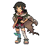

# Sky Pillar — Trainer Pokémon

---

## [ Main Area (Postgame) ]

### Trainer Rosters

| Trainer | P1 | P2 | P3 | P4 | P5 | P6 |
|:-------:|:--:|:--:|:--:|:--:|:--:|:--:|
|  Lorekeeper Zinnia [713] | 
 [Hydreigon](../../pokemon/hydreigon.md) Lv. 79
 | 
 [Goodra](../../pokemon/goodra.md) Lv. 79
 | 
 [Tyranitar](../../pokemon/tyranitar.md) Lv. 79
 | 
 [Dragonite](../../pokemon/dragonite.md) Lv. 79
 | 
 [Garchomp](../../pokemon/garchomp.md) Lv. 79
 | 
 [Salamence](../../pokemon/salamence.md) Lv. 81
 |

### Special Battles

1. [Zinnia]()

