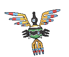

# Sky Pillar — Wild Pokémon

## [ Main Area (Postgame) ]

### Floor

| Sprite | Pokémon | Encounter | Chance |
|:------:|---------|:---------:|--------|
|  | [Raticate](../../pokemon/raticate.md/) Lv. 67 |  Floor | 10% |
|  | [Ariados](../../pokemon/ariados.md/) Lv. 67 |  Floor | 10% |
|  | [Altaria](../../pokemon/altaria.md/) Lv. 67 |  Floor | 10% |
|  | [Claydol](../../pokemon/claydol.md/) Lv. 67 |  Floor | 10% |
|  | [Spiritomb](../../pokemon/spiritomb.md/) Lv. 67 |  Floor | 10% |
|  | [Sigilyph](../../pokemon/sigilyph.md/) Lv. 67 |  Floor | 10% |
|  | [Mienshao](../../pokemon/mienshao.md/) Lv. 67 |  Floor | 10% |
|  | [Druddigon](../../pokemon/druddigon.md/) Lv. 67 |  Floor | 10% |
|  | [Golurk](../../pokemon/golurk.md/) Lv. 67 |  Floor | 10% |
|  | [Noivern](../../pokemon/noivern.md/) Lv. 67 |  Floor | 10% |

### Horde

| Sprite | Pokémon | Encounter | Chance |
|:------:|---------|:---------:|--------|
|  | [Altaria](../../pokemon/altaria.md/) Lv. 43 |  Horde | 100% |

