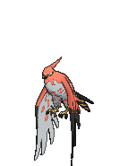

# Soaring in the Sky — Wild Pokémon

**Note:** <i>You will only see these Pokémon if you were able to use the .cro file!</i>

**Hint:** <i>Any wild Pokémon found here will have their hidden ability as well as at least 3 perfect IVs.</i>

### Flocks

| Sprite | Pokémon | Encounter | Chance |
|:------:|---------|:---------:|--------|
|  | [Pidgeot](../../pokemon/pidgeot.md/) Lv. 60 |  Flocks | 14% |
|  | [Dragonite](../../pokemon/dragonite.md/) Lv. 60 |  Flocks | 14% |
|  | [Staraptor](../../pokemon/staraptor.md/) Lv. 60 |  Flocks | 14% |
|  | [Honchkrow](../../pokemon/honchkrow.md/) Lv. 60 |  Flocks | 14% |
|  | [Togekiss](../../pokemon/togekiss.md/) Lv. 60 |  Flocks | 14% |
|  | [Unfezant](../../pokemon/unfezant.md/) Lv. 60 |  Flocks | 14% |
|  | [Talonflame](../../pokemon/talonflame.md/) Lv. 60 |  Flocks | 14% |

