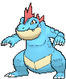
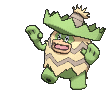

# Sootopolis City — Trainer Pokémon

---

## [ Gym ]

### Trainer Rosters

| Trainer | P1 | P2 | P3 | P4 | P5 | P6 |
|:-------:|:--:|:--:|:--:|:--:|:--:|:--:|
|  Lass Andrea [341] | 
 [Simipour](../../pokemon/simipour.md) Lv. 62
 | 
 [Vaporeon](../../pokemon/vaporeon.md) Lv. 62
 | 
 [Wailord](../../pokemon/wailord.md) Lv. 62
 |
|  Beauty Tiffany [340] | 
 [Mantine](../../pokemon/mantine.md) Lv. 62
 | 
 [Seaking](../../pokemon/seaking.md) Lv. 62
 | 
 [Cloyster](../../pokemon/cloyster.md) Lv. 62
 |
|  Beauty Bridget [339] | 
 [Slowbro](../../pokemon/slowbro.md) Lv. 62
 | 
 [Tentacruel](../../pokemon/tentacruel.md) Lv. 62
 | 
 [Quagsire](../../pokemon/quagsire.md) Lv. 62
 |
|  Beauty Connie [338] | 
 [Corsola](../../pokemon/corsola.md) Lv. 62
 | 
 [Octillery](../../pokemon/octillery.md) Lv. 62
 | 
 [Whiscash](../../pokemon/whiscash.md) Lv. 62
 |
|  Beauty Olivia [594] | 
 [Floatzel](../../pokemon/floatzel.md) Lv. 62
 | 
 [Swanna](../../pokemon/swanna.md) Lv. 62
 | 
 [Barbaracle](../../pokemon/barbaracle.md) Lv. 62
 |
|  Lady Brianna [646] | 
 [Seismitoad](../../pokemon/seismitoad.md) Lv. 62
 | 
 [Lumineon](../../pokemon/lumineon.md) Lv. 62
 | 
 [Pelipper](../../pokemon/pelipper.md) Lv. 62
 |
|  Poké Fan Marissa [647] | 
 [Lanturn](../../pokemon/lanturn.md) Lv. 62
 | 
 [Samurott](../../pokemon/samurott.md) Lv. 62
 | 
 [Azumarill](../../pokemon/azumarill.md) Lv. 62
 |
|  Lass Crissy [342] | 
 [Poliwrath](../../pokemon/poliwrath.md) Lv. 62
 | 
 [Feraligatr](../../pokemon/feraligatr.md) Lv. 62
 | 
 [Sharpedo](../../pokemon/sharpedo.md) Lv. 62
 |
|  Leader Wallace [572] | 
 [Politoed](../../pokemon/politoed.md) Lv. 65
 | 
 [Ludicolo](../../pokemon/ludicolo.md) Lv. 65
 | 
 [Kingdra](../../pokemon/kingdra.md) Lv. 65
 | 
 [Starmie](../../pokemon/starmie.md) Lv. 65
 | 
 [Milotic](../../pokemon/milotic.md) Lv. 65
 | 
 [Swampert](../../pokemon/swampert.md) Lv. 67
 |

### Special Battles

1. [Wallace](special_battles.md#wallace)

