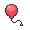

# Victory Road — Special Battles

---

## [ 2F ]

### Wally

| Pokémon | Attributes | Item | Moves |
|:-------:|------------|:----:|-------|
|  | **Lv. 70** [Roserade](../../pokemon/roserade.md) **Ability:** Poison Point   |  Focus Sash | 1. Sleep Powder 2. Petal Dance 3. Sludge Bomb 4. Dazzling Gleam |
|  | **Lv. 70** [Talonflame](../../pokemon/talonflame.md) **Ability:** Gale Wings   |  Sharp Beak | 1. Brave Bird 2. Flare Blitz 3. Swords Dance 4. Roost |
|  | **Lv. 70** [Azumarill](../../pokemon/azumarill.md) **Ability:** Huge Power   |  Assault Vest | 1. Aqua Tail 2. Play Rough 3. Superpower 4. Knock Off |
|  | **Lv. 70** [Magnezone](../../pokemon/magnezone.md) **Ability:** Sturdy   |  Air Balloon | 1. Thunderbolt 2. Flash Cannon 3. Signal Beam 4. Thunder Wave |
|  | **Lv. 70** [Garchomp](../../pokemon/garchomp.md) **Ability:** Rough Skin   |  Yache Berry | 1. Outrage 2. Earthquake 3. Stone Edge 4. Fire Blast |
|  | **Lv. 72** [Gallade](../../pokemon/gallade.md) **Ability:** Justified   |  Galladite | 1. Close Combat 2. Zen Headbutt 3. Knock Off 4. Protect |

