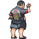
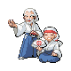
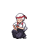
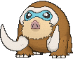
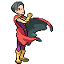

# Victory Road — Trainer Pokémon

---

## [ 1F ]

### Trainer Rosters

| Trainer | P1 | P2 | P3 | P4 | P5 |
|:-------:|:--:|:--:|:--:|:--:|:--:|
|  Ace Trainer Albert [344] | 
 [Golem](../../pokemon/golem.md) Lv. 65
 | 
 [Venusaur](../../pokemon/venusaur.md) Lv. 65
 | 
 [Avalugg](../../pokemon/avalugg.md) Lv. 65
 | 
 [Jolteon](../../pokemon/jolteon.md) Lv. 65
 | 
 [Pidgeot](../../pokemon/pidgeot.md) Lv. 65
 |
|  Ace Trainer Hope [348] | 
 [Glaceon](../../pokemon/glaceon.md) Lv. 65
 | 
 [Gliscor](../../pokemon/gliscor.md) Lv. 65
 | 
 [Volcarona](../../pokemon/volcarona.md) Lv. 65
 | 
 [Exeggutor](../../pokemon/exeggutor.md) Lv. 65
 | 
 [Audino](../../pokemon/audino.md) Lv. 65
 |
|  Ace Trainer Edgar [343] | 
 [Gogoat](../../pokemon/gogoat.md) Lv. 65
 | 
 [Lapras](../../pokemon/lapras.md) Lv. 65
 | 
 [Porygon-Z](../../pokemon/porygon-z.md) Lv. 65
 | 
 [Shedinja](../../pokemon/shedinja.md) Lv. 65
 | 
 [Mawile](../../pokemon/mawile.md) Lv. 65
 |
|  Street Thug Regan [793] | 
 [Drapion](../../pokemon/drapion.md) Lv. 65
 | 
 [Weavile](../../pokemon/weavile.md) Lv. 65
 | 
 [Krookodile](../../pokemon/krookodile.md) Lv. 65
 | 
 [Toxicroak](../../pokemon/toxicroak.md) Lv. 65
 | 
 [Beedrill](../../pokemon/beedrill.md) Lv. 65
 |
|  Brains & Brawn Aden & Finn [732] | 
 [Musharna](../../pokemon/musharna.md) Lv. 65
 | 
 [Primeape](../../pokemon/primeape.md) Lv. 65
 | 
 [Gardevoir](../../pokemon/gardevoir.md) Lv. 65
 | 
 [Pangoro](../../pokemon/pangoro.md) Lv. 65
 | 
 [Medicham](../../pokemon/medicham.md) Lv. 65
 |

---

## [ B1F ]

### Trainer Rosters

| Trainer | P1 | P2 | P3 | P4 | P5 |
|:-------:|:--:|:--:|:--:|:--:|:--:|
|  Expert Bryn [835] | 
 [Machamp](../../pokemon/machamp.md) Lv. 65
 | 
 [Throh](../../pokemon/throh.md) Lv. 65
 | 
 [Sawk](../../pokemon/sawk.md) Lv. 65
 | 
 [Mienshao](../../pokemon/mienshao.md) Lv. 65
 | 
 [Lopunny](../../pokemon/lopunny.md) Lv. 65
 |
|  Ace Duo Jude & Rory [830] | 
 [Rotom](../../pokemon/rotom.md) Lv. 65
 | 
 [Mamoswine](../../pokemon/mamoswine.md) Lv. 65
 | 
 [Electivire](../../pokemon/electivire.md) Lv. 65
 | 
 [Magmortar](../../pokemon/magmortar.md) Lv. 65
 | 
 [Scizor](../../pokemon/scizor.md) Lv. 65
 |
|  Expert Theodore [765] | 
 [Chesnaught](../../pokemon/chesnaught.md) Lv. 65
 | 
 [Hitmonlee](../../pokemon/hitmonlee.md) Lv. 65
 | 
 [Hitmonchan](../../pokemon/hitmonchan.md) Lv. 65
 | 
 [Emboar](../../pokemon/emboar.md) Lv. 65
 | 
 [Blaziken](../../pokemon/blaziken.md) Lv. 65
 |
|  Ace Trainer Vito [346] | 
 [Electrode](../../pokemon/electrode.md) Lv. 65
 | 
 [Swellow](../../pokemon/swellow.md) Lv. 65
 | 
 [Shiftry](../../pokemon/shiftry.md) Lv. 65
 | 
 [Darmanitan](../../pokemon/darmanitan-standard.md) Lv. 65
 | 
 [Alakazam](../../pokemon/alakazam.md) Lv. 65
 |
|  Dragon Tamer Egon [764] | 
 [Noivern](../../pokemon/noivern.md) Lv. 65
 | 
 [Druddigon](../../pokemon/druddigon.md) Lv. 65
 | 
 [Steelix](../../pokemon/steelix.md) Lv. 65
 | 
 [Arbok](../../pokemon/arbok.md) Lv. 65
 | 
 [Charizard](../../pokemon/charizard.md) Lv. 65
 |

### Rematches

| Trainer | P1 | P2 | P3 | P4 | P5 |
|:-------:|:--:|:--:|:--:|:--:|:--:|
|  Ace Duo Jude & Rory [831] | 
 [Rotom](../../pokemon/rotom.md) Lv. 75
 | 
 [Mamoswine](../../pokemon/mamoswine.md) Lv. 75
 | 
 [Electivire](../../pokemon/electivire.md) Lv. 75
 | 
 [Magmortar](../../pokemon/magmortar.md) Lv. 75
 | 
 [Scizor](../../pokemon/scizor.md) Lv. 75
 |

---

## [ 2F ]

### Trainer Rosters

| Trainer | P1 | P2 | P3 | P4 | P5 | P6 |
|:-------:|:--:|:--:|:--:|:--:|:--:|:--:|
|  PKMN Trainer Wally [583] | 
 [Roserade](../../pokemon/roserade.md) Lv. 70
 | 
 [Talonflame](../../pokemon/talonflame.md) Lv. 70
 | 
 [Azumarill](../../pokemon/azumarill.md) Lv. 70
 | 
 [Magnezone](../../pokemon/magnezone.md) Lv. 70
 | 
 [Garchomp](../../pokemon/garchomp.md) Lv. 70
 | 
 [Gallade](../../pokemon/gallade.md) Lv. 72
 |

### Special Battles

1. [Wally](special_battles.md#wally)

