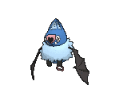
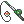
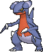

# Victory Road — Wild Pokémon

---

## [ 1F ]

### Cave

| Sprite | Pokémon | Encounter | Chance |
|:------:|---------|:---------:|--------|
|  | [Golbat](../../pokemon/golbat.md/) Lv. 59 |  Cave | 10% |
|  | [Graveler](../../pokemon/graveler.md/) Lv. 59 |  Cave | 10% |
|  | [Marowak](../../pokemon/marowak.md/) Lv. 59 |  Cave | 10% |
|  | [Rhydon](../../pokemon/rhydon.md/) Lv. 59 |  Cave | 10% |
|  | [Steelix](../../pokemon/steelix.md/) Lv. 59 |  Cave | 10% |
|  | [Ursaring](../../pokemon/ursaring.md/) Lv. 59 |  Cave | 10% |
|  | [Donphan](../../pokemon/donphan.md/) Lv. 59 |  Cave | 10% |
|  | [Lairon](../../pokemon/lairon.md/) Lv. 59 |  Cave | 10% |
|  | [Boldore](../../pokemon/boldore.md/) Lv. 59 |  Cave | 10% |
|  | [Swoobat](../../pokemon/swoobat.md/) Lv. 59 |  Cave | 10% |

### Horde

| Sprite | Pokémon | Encounter | Chance |
|:------:|---------|:---------:|--------|
|  | [Loudred](../../pokemon/loudred.md/) Lv. 37 |  Horde | 100% |

### Surfing

| Sprite | Pokémon | Encounter | Chance |
|:------:|---------|:---------:|--------|
|  | [Floatzel](../../pokemon/floatzel.md/) Lv. 55 - 65 |  Surfing | 50% |
|  | [Azumarill](../../pokemon/azumarill.md/) Lv. 55 - 65 |  Surfing | 50% |

### Old Rod

| Sprite | Pokémon | Encounter | Chance |
|:------:|---------|:---------:|--------|
|  | [Poliwag](../../pokemon/poliwag.md/) Lv. 15 |  Old Rod | 50% |
|  | [Basculin](../../pokemon/basculin-red-striped.md/) Lv. 15 |  Old Rod | 50% |

### Good Rod

| Sprite | Pokémon | Encounter | Chance |
|:------:|---------|:---------:|--------|
|  | [Poliwhirl](../../pokemon/poliwhirl.md/) Lv. 35 |  Good Rod | 50% |
|  | [Basculin](../../pokemon/basculin-red-striped.md/) Lv. 35 |  Good Rod | 50% |

### Super Rod

| Sprite | Pokémon | Encounter | Chance |
|:------:|---------|:---------:|--------|
|  | [Poliwhirl](../../pokemon/poliwhirl.md/) Lv. 55 |  Super Rod | 50% |
|  | [Basculin](../../pokemon/basculin-red-striped.md/) Lv. 55 |  Super Rod | 50% |

---

## [ B1F ]

### Cave

| Sprite | Pokémon | Encounter | Chance |
|:------:|---------|:---------:|--------|
|  | [Kadabra](../../pokemon/kadabra.md/) Lv. 59 |  Cave | 10% |
|  | [Machoke](../../pokemon/machoke.md/) Lv. 59 |  Cave | 10% |
|  | [Haunter](../../pokemon/haunter.md/) Lv. 59 |  Cave | 10% |
|  | [Loudred](../../pokemon/loudred.md/) Lv. 59 |  Cave | 10% |
|  | [Hariyama](../../pokemon/hariyama.md/) Lv. 59 |  Cave | 10% |
|  | [Sableye*](../../pokemon/sableye.md/) Lv. 59 |  Cave | 5% |
|  | [Mawile*](../../pokemon/mawile.md/) Lv. 59 |  Cave | 5% |
|  | [Medicham](../../pokemon/medicham.md/) Lv. 59 |  Cave | 10% |
|  | [Gabite](../../pokemon/gabite.md/) Lv. 59 |  Cave | 10% |
|  | [Gurdurr](../../pokemon/gurdurr.md/) Lv. 59 |  Cave | 10% |
|  | [Galvantula](../../pokemon/galvantula.md/) Lv. 59 |  Cave | 10% |

### Horde

| Sprite | Pokémon | Encounter | Chance |
|:------:|---------|:---------:|--------|
|  | [Galvantula](../../pokemon/galvantula.md/) Lv. 37 |  Horde | 100% |

### Surfing

| Sprite | Pokémon | Encounter | Chance |
|:------:|---------|:---------:|--------|
|  | [Floatzel](../../pokemon/floatzel.md/) Lv. 55 - 65 |  Surfing | 50% |
|  | [Azumarill](../../pokemon/azumarill.md/) Lv. 55 - 65 |  Surfing | 50% |

### Old Rod

| Sprite | Pokémon | Encounter | Chance |
|:------:|---------|:---------:|--------|
|  | [Poliwag](../../pokemon/poliwag.md/) Lv. 15 |  Old Rod | 50% |
|  | [Basculin](../../pokemon/basculin-red-striped.md/) Lv. 15 |  Old Rod | 50% |

### Good Rod

| Sprite | Pokémon | Encounter | Chance |
|:------:|---------|:---------:|--------|
|  | [Poliwhirl](../../pokemon/poliwhirl.md/) Lv. 35 |  Good Rod | 50% |
|  | [Basculin](../../pokemon/basculin-red-striped.md/) Lv. 35 |  Good Rod | 50% |

### Super Rod

| Sprite | Pokémon | Encounter | Chance |
|:------:|---------|:---------:|--------|
|  | [Poliwhirl](../../pokemon/poliwhirl.md/) Lv. 55 |  Super Rod | 50% |
|  | [Basculin](../../pokemon/basculin-red-striped.md/) Lv. 55 |  Super Rod | 50% |

---

## [ 2F ]

### Surfing

| Sprite | Pokémon | Encounter | Chance |
|:------:|---------|:---------:|--------|
|  | [Floatzel](../../pokemon/floatzel.md/) Lv. 55 - 65 |  Surfing | 50% |
|  | [Azumarill](../../pokemon/azumarill.md/) Lv. 55 - 65 |  Surfing | 50% |

### Old Rod

| Sprite | Pokémon | Encounter | Chance |
|:------:|---------|:---------:|--------|
|  | [Poliwag](../../pokemon/poliwag.md/) Lv. 15 |  Old Rod | 50% |
|  | [Basculin](../../pokemon/basculin-red-striped.md/) Lv. 15 |  Old Rod | 50% |

### Good Rod

| Sprite | Pokémon | Encounter | Chance |
|:------:|---------|:---------:|--------|
|  | [Poliwhirl](../../pokemon/poliwhirl.md/) Lv. 35 |  Good Rod | 50% |
|  | [Basculin](../../pokemon/basculin-red-striped.md/) Lv. 35 |  Good Rod | 50% |

### Super Rod

| Sprite | Pokémon | Encounter | Chance |
|:------:|---------|:---------:|--------|
|  | [Poliwhirl](../../pokemon/poliwhirl.md/) Lv. 55 |  Super Rod | 50% |
|  | [Basculin](../../pokemon/basculin-red-striped.md/) Lv. 55 |  Super Rod | 50% |

