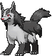

# Weather Institute — Special Battles

---

## [ Main Area ]

### Tabitha

| Pokémon | Attributes | Item | Moves |
|:-------:|------------|:----:|-------|
|  | **Lv. 46** [Mightyena](../../pokemon/mightyena.md) **Ability:** Intimidate  | Muscle Band | 1. Sucker Punch 2. Play Rough 3. Swagger 4. Iron Tail |
|  | **Lv. 46** [Weezing](../../pokemon/weezing.md) **Ability:** Levitate  | Expert Belt | 1. Sludge Bomb 2. Flamethrower 3. Thunderbolt 4. Toxic Spikes |
|  | **Lv. 46** [Snorlax](../../pokemon/snorlax.md) **Ability:** Thick Fat  | Leftovers | 1. Body Slam 2. Crunch 3. Rest 4. Sleep Talk |
|  | **Lv. 46** [Gigalith](../../pokemon/gigalith.md) **Ability:** Sturdy  | Custap Berry | 1. Stone Edge 2. Superpower 3. Earthquake 4. Heavy Slam |
|  | **Lv. 46** [Camerupt](../../pokemon/camerupt.md) **Ability:** Solid Rock   | Focus Sash | 1. Flamethrower 2. Earth Power 3. Rock Slide 4. Flash Cannon |
|  | **Lv. 48** [Darmanitan](../../pokemon/darmanitan-standard.md) **Ability:** Sheer Force  | Life Orb | 1. Flare Blitz 2. Rock Slide 3. Zen Headbutt 4. Earthquake |
### Shelly

| Pokémon | Attributes | Item | Moves |
|:-------:|------------|:----:|-------|
|  | **Lv. 46** [Liepard](../../pokemon/liepard.md) **Ability:** Prankster  | Black Glasses | 1. Dark Pulse 2. Play Rough 3. Thunder Wave 4. Swagger |
|  | **Lv. 46** [Muk](../../pokemon/muk.md) **Ability:** Poison Touch  | Black Sludge | 1. Gunk Shot 2. Earthquake 3. Infestation 4. Toxic |
|  | **Lv. 46** [Lapras](../../pokemon/lapras.md) **Ability:** Water Absorb   | Leftovers | 1. Blizzard 2. Surf 3. Thunderbolt 4. Freeze-Dry |
|  | **Lv. 46** [Roserade](../../pokemon/roserade.md) **Ability:** Poison Point   | Expert Belt | 1. Giga Drain 2. Sludge Bomb 3. Dazzling Gleam 4. Shadow Ball |
|  | **Lv. 46** [Sharpedo](../../pokemon/sharpedo.md) **Ability:** Speed Boost   | Focus Sash | 1. Hydro Pump 2. Crunch 3. Destiny Bond 4. Earthquake |
|  | **Lv. 48** [Jellicent](../../pokemon/jellicent.md) **Ability:** Cursed Body   | Sitrus Berry | 1. Recover 2. Toxic 3. Surf 4. Shadow Ball |

