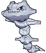

# Weather Institute — Trainer Pokémon

---

## [ Main Area ]

### Trainer Rosters

| Trainer | P1 | P2 | P3 | P4 | P5 | P6 |
|:-------:|:--:|:--:|:--:|:--:|:--:|:--:|
|  Team Magma Grunt [261] | 
 [Mightyena](../../pokemon/mightyena.md) Lv. 43
 |
|  Team Magma Grunt [262] | 
 [Steelix](../../pokemon/steelix.md) Lv. 43
 |
|  Team Magma Grunt [263] | 
 [Camerupt](../../pokemon/camerupt.md) Lv. 43
 |
|  Team Magma Grunt [264] | 
 [Golbat](../../pokemon/golbat.md) Lv. 43
 |
|  Magma Admin Tabitha [693] | 
 [Mightyena](../../pokemon/mightyena.md) Lv. 46
 | 
 [Weezing](../../pokemon/weezing.md) Lv. 46
 | 
 [Snorlax](../../pokemon/snorlax.md) Lv. 46
 | 
 [Gigalith](../../pokemon/gigalith.md) Lv. 46
 | 
 [Camerupt](../../pokemon/camerupt.md) Lv. 46
 | 
 [Darmanitan](../../pokemon/darmanitan-standard.md) Lv. 48
 |
|  Team Aqua Grunt [256] | 
 [Liepard](../../pokemon/liepard.md) Lv. 43
 |
|  Team Aqua Grunt [257] | 
 [Tangrowth](../../pokemon/tangrowth.md) Lv. 43
 |
|  Team Aqua Grunt [258] | 
 [Sharpedo](../../pokemon/sharpedo.md) Lv. 43
 |
|  Team Aqua Grunt [259] | 
 [Golbat](../../pokemon/golbat.md) Lv. 43
 |
|  Aqua Admin Shelly [690] | 
 [Liepard](../../pokemon/liepard.md) Lv. 46
 | 
 [Muk](../../pokemon/muk.md) Lv. 46
 | 
 [Lapras](../../pokemon/lapras.md) Lv. 46
 | 
 [Roserade](../../pokemon/roserade.md) Lv. 46
 | 
 [Sharpedo](../../pokemon/sharpedo.md) Lv. 46
 | 
 [Jellicent](../../pokemon/jellicent.md) Lv. 48
 |

### Special Battles

1. [Tabitha]()

1. [Shelly]()

